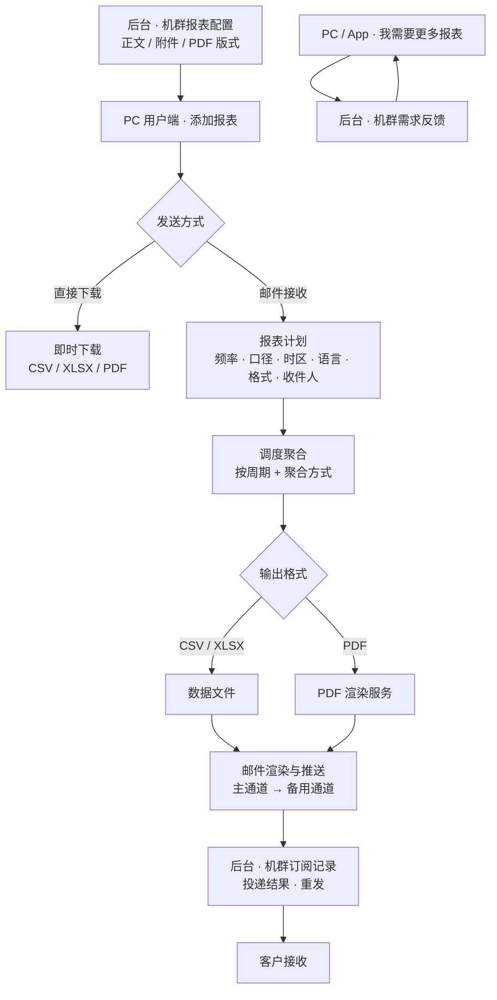
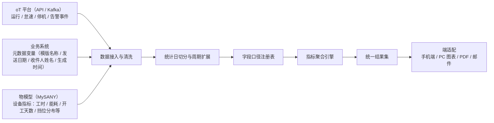
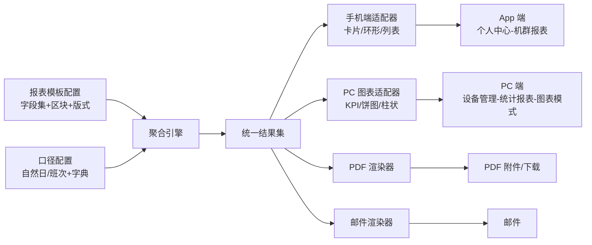

# 三一设备报表项目 PRD v2.0

# 原型入口

| 目录 | 文件 |
| --- | --- |
| **管理后台** `V2/mysany后台V2/` | 机群报表配置.html · 机群订阅记录.html · 机群需求反馈.html |
| **PC 用户端** `V2/MysnayPC端V2/` | 报表模版.html · 管理报表.html · 个人中心.html |
| **App 端** `V2/app/` | 机群数据.html · 报表库.html · 报表库-缺省页.html · 我的报表.html · 我的报表-缺省页.html · 我需要更多报表.html · 个人中心页.html |
| **PDF 版式** `V2/报表模版/` | index.html · 设备性能报表-SANY.html · 演示报表/机群版（7 张）· 演示报表/单机版（7 张）· 演示报表/机型适用性对照-SANY.html |
| **UI 设计稿** | `V2/价格UI设计稿.html` |

---

# 第 1 部分：业务概要

## 1.1 项目背景

v1.0 已于 8 月上线，完成「管理报表订阅 → 邮件推送 → 后台模版配置」闭环，客户可用 CSV/XLSX 附件获取设备数据。本次继续迭代丰富：

## 1.2 项目目标

| 序号 | 功能 | 描述 |
| --- | --- | --- |
| 1 | **PDF 格式报表** | 在 CSV/XLSX 明细附件之外，报表支持 PDF，含看板组件库，可配置后直观查看 |
| 2 | **邮件发送模板** | 支持 HTML 样式：富文本编辑，推送时由系统统一转换 |
| 3 | **邮件发送记录** | 新增**接收人** |
| 4 | **班次维度** | 前端新增班次维度，统计边界可选自然日或自定义班次（如 07:00–19:00 一个班次） |
| 5 | **指标接入深度** | 丰富矿卡、挖掘机、履带吊的指标接入深度 |
| 6 | **指标计算口径** | 从一律求和，丰富为按字段登记聚合方式（求和 / 重算 / 期末快照 / 差值 / 最大值 / 去重计数 / 不呈现） |
| 7 | **PDF 附件配置** | 可视化版式设计器（区块编排 + 变量绑定 + 实时预览），不保留 Word 模板方式 |
| 8 | **PDF 预览** | 列表 / 详情弹窗内嵌 PDF 预览；设计器实时预览 |
| 9 | **报表需求征集** | PC 端与 App 端支持用户报表需求征集：勾选候选报表或填写自定义诉求，提交后由后台统一处理 |
| 10 | **跨模型同名字段自动勾选** | 配置 CSV/XLSX 附件列或 PDF 组件指标时，勾选一个字段后，**其他物模型（设备类型）下键值相同的字段自动一并勾选**，避免同一指标逐个模型重复勾选 |

---

# 第 2 部分：产品定义

## 2.1 业务流程

## 2.2 报表体系设计

本期新增 **7 张**报表，**单机与机群各自成表**（单机一个报表、机群一个报表；口径由报表本身决定）：

| 序号 | 报表 | 说明 |
| :-: | --- | --- |
| 1 | 综合报表 | 工时 / 能耗 / 里程总览：指标卡 + 趋势图 + 明细表 + 设备排行 + 贡献占比 |
| 2 | 超时工作报表 | 工时超时判定、超时天数与超时累计时长 |
| 3 | 电池充电参数报表 | 充入电量、充电时长、剩余电量（SOC）、分段充电与每日充电次数 |
| 4 | 设备能耗报表 | 油耗 / 电耗总量与单位能耗 |
| 5 | 设备工作模式报表 | 档位分布与各挡位时长、行走机构时长 |
| 6 | 设备移动里程报表 | 里程 / 车速 / 载荷 / 定位与行驶行为 |
| 7 | 设备异常通知报表 | 告警事件与等级汇总、事件明细台账 |

## 2.3 统计口径

| 口径 | 说明 |
| --- | --- |
| **班次** | 默认 `07:00–19:00` + `19:00–07:00`，可增删时段；单段 1–24 小时、时段不重叠、合计满 24 小时 |
| **日** | 自然日 00:00 – 24:00 |
| **周** | 自然周 周一 00:00 – 周日 24:00 |
| **月** | 自然月 1 日 00:00 – 月末 24:00 |

---

# 第 3 部分：用户交互设计

## 3.1 PC 管理后台

### 3.1.1 机群报表配置

#### 3.1.1.1 页面原型

功能入口：左侧导航 → 机群报表订阅 → 机群报表配置，默认展示邮件模版列表页。

[详情见原型图片内容]

[详情见原型图片内容]

#### 3.1.1.2 列表页需求说明

页面布局（从上到下）：

- 卡片头：模版列表，右侧显示计数「共 N 个模版」，筛选后追加「（筛选后 M 个）」。
- 筛选工具栏：`模版名称`（占位「输入模版名称...」，回车即触发搜索）、`适用范围`（`全部适用范围` / `单机` / `机群`）、`语言类型`（`全部语言` + 15 种语言）、`搜索` / `重置`。
- 数据列表区：8 列表格（图标 / 模版名称 / 模版描述 / **适用范围** / 语言 / 启用 / 最近更新 / 操作）；列表为空时展示空态文案「无匹配模版」。

列表功能规范：

- 列说明：
  - 「适用范围」列展示该模版支持的统计口径徽标：`单机`（灰）/ `机群`（红），两个口径都支持时并列展示（如 `单机` `机群`）。
  - 「语言」列展示第一个已配置语言（蓝色标签，如 `简体中文`）。
  - 「启用」列展示 `已启用`（绿）/ `已停用`（灰）。
  - 「操作」列包含 `编辑` 与 `删除` 两个操作链接。

#### 3.1.1.3 编辑模版弹窗 - 基本信息

[详情见原型图片内容]

- 模版名称*：占位「如：设备运行日报模版」。
- 模版描述*：占位「如：适用于挖掘机设备每日运行数据汇报」。
- 基本信息分两行排布：**第 1 行 = 模版名称 / 模版描述**（两个输入框各占一半宽度，避免被挤窄）；**第 2 行 = 启用此模版 / 整体口径 / 统计时间维度**（三列等宽）。
- 启用此模版：第 2 行第 1 列，开关右侧跟一枚状态文案（`已启用` / `已停用`，与列表「启用」列口径一致，随开关即时切换），切换后随保存生效，**不随步骤切换而隐藏**。
- 整体口径：第 2 行第 2 列的 `单机设备` / `机群（聚合）` 分段切换，是**整份报表（模版）级**的属性，**不放在第 2、3 步的组件里**；切换即同时切换第 2 步的数据列配置与第 3 步 PDF 版式设计器的数据模块与版式（两套配置分别保存、互不影响）。
- 统计时间维度：第 2 行第 3 列（**紧接「整体口径」之后**）的 `日报` / `周报` / `月报` 三个内联勾选，**默认三项全选**、可取消（至少保留一项）；同样是**模版级**设置（单机 / 机群共用，不随口径切换变化），随保存落库。该控件**原在第 3 步设计器的工具栏里，现已上移到基本信息行**；用户在第 3 步之前就可勾选，进入设计器后按勾选结果初始化（无已保存版式时以界面勾选为准）。
- 顶部「编辑语言」下拉（15 种）：切换语言后自动保存当前编辑内容，未配置的语言从简体中文复制；编辑已有模版时语言锁定不可改。
- 新建模版会直接写入示例数据（示例名称、描述、正文），因此可一路点「下一步」。

#### 3.1.1.4 编辑模版弹窗 - 三步向导

[详情见原型图片内容]

- 步骤条：`1 邮件正文`（必填）→ `2 XLSX / CSV 附件` → `3 PDF 附件`；每步状态显示 `必填` / `未配置` / `已配置` / `已跳过`（跳过的步骤置灰）。
- 步骤条可点击直接跳转：离开当前步骤前先保存该步内容，并回到弹窗顶部。
- 步骤 1 邮件正文：可用变量区（点击插入 `{{模版名称}}`、`{{发送日期}}`、`{{收件人姓名}}`、`{{生成时间}}`、`{{一键订阅}}`、`{{查看报告}}`）、`正文内容 *`、模式切换 `富文本` / `</> HTML 源码`。
- 步骤 2 XLSX / CSV 附件：`文件名模板`（支持变量，占位「如：{{模版名称}}_{{发送日期}}」）+ 当前口径（由**弹窗顶部整体口径分段**决定）的数据列配置；仅本步可跳过。
- 步骤 3 PDF 附件：`文件名模板` + PDF 版式设计器。
- 弹窗底部：`跳过此步`（仅第 2 步且未跳过时显示，文案「跳过此步（不生成 XLSX/CSV 附件）」）、`恢复此步`、`上一步` / `下一步：XLSX / CSV 附件`（第 2 步为「下一步：PDF 附件」，第 3 步隐藏）、`完成并保存`（仅第 3 步显示）。
- **新增（新建模版）提交后不关闭弹窗**：系统 Toast 提示「**添加成功**」，新模版即时出现在列表里（计数同步刷新）；可**直接在弹窗顶部「编辑语言」切换语言继续添加**其它语言的内容（标题保持「新建邮件模版」），再次保存同样不关闭弹窗、继续提示「添加成功」。**编辑已有模版**时保存则关闭弹窗并提示「模版保存成功」。

#### 3.1.1.5 邮件正文编辑（步骤 1）

| 现状问题 | 表现 | 本次做法 |
| --- | --- | --- |
| 样式丢失 | 按钮变形、表格错位、字号不一致 | 正文由系统统一转换为客户端可正常解析的格式，管理员无需关心实现方式 |
| 呈现单薄 | 仅「通知 + 一个按钮」 | 富文本支持标题、加粗 / 斜体 / 下划线 / 删除线、文字与背景色、对齐、列表、引用、代码块、链接、图片 |
| 多语言不齐 | 阿拉伯语 RTL 与泰语佛历展示异常 | 按订阅语言自动切换文字方向与日期体系 |

编辑规则：

- 正文编辑（两种模式，右上角切换）：
  - 富文本模式（默认，富文本编辑器）：管理员所见即邮件主体内容；工具栏含标题 / 加粗 / 斜体 / 下划线 / 删除线 / 文字色与背景色 / 对齐 / 有序与无序列表 / 引用 / 代码块 / 链接 / 图片 / 清除格式。
  - HTML 源码模式：直接编辑正文 HTML 源码，内容原样保存、往返不丢；切回富文本时提示「编辑器不支持的结构（如样式块、表格）可能被简化」。
  - 变量插入：点击变量标签插入到光标处，发送时自动替换，插入后以标签高亮识别。
- 系统固定部分（管理员不可改）：
  - 页头品牌条：`SANY · MySANY 设备管理平台`（三一红底白字，随语言切换文案）。
  - 页脚：「此邮件为系统自动发送，请勿直接回复。」+ 服务团队署名 + 「调整订阅」文字入口。
  - 主按钮：「查看并下载完整报告」→ `{{查看报告}}`。
- 变量词典规模：14 类设备类型、34 个物模型、约 100+ 条字段指标。
- 界面语言：15 种。

#### 3.1.1.6 XLSX / CSV 附件配置（步骤 2）

- 附件基本设置：文件名模板（支持变量）必填，系统自动补充扩展名。
- 口径切换：由**弹窗顶部的整体口径分段**统一控制（`单机设备` / `机群（聚合）`）。
- 单机配置（三级联动）：
  - `设备类型 → 物模型 → 字段` 三栏级联，字段可多选。
  - 底部显示 `已选：N 个变量`，并提供 `取消全选` / `全选当前模型`。
  - 已配置的物模型以标签列出，已选变量集中回显（点击 × 移除）。
- 机群配置（数据列配置表）：
  - 列为 `列名 / 模板变量 / 操作`，可 `+ 添加列`。
  - 模板变量单元格点击后弹出三级联动浮层（标题「选择映射字段」，副文「设备类型 → 物模型 → 字段（勾选需映射的变量，可跨模型多选）」）选择映射字段，与 PDF 附件复用同一弹层。
- 基础字段「统计周期 / 设备机型 / 设备编号」在各级联中始终存在、置灰不可删。

#### 3.1.1.7 规则与边界值

规则：

- 必填与校验：模版名称、描述、正文必填；未通过时拦截并提示具体原因（`模版名称不能为空` / `模版描述不能为空` / `正文内容不能为空`），且**弹窗不关闭**。校验对象是**当前编辑语言**的内容（原型为单语言模式：切换「编辑语言」会重建该语言内容、清掉其它语言，因此不能固定按中文判定）。
- 语言与适用范围：编辑已有模版时语言不可改；适用范围自动派生、管理员不能手工增删。
- 数据列配置归属：单机配置与机群配置各存一套；未进入某个步骤时不得覆盖该步骤已保存的配置，保证两套配置互不冲掉。
- 跳过与恢复：仅第 2 步可跳过；跳过后该步配置不参与保存；可点「恢复此步」把配置找回。

边界值：

- 列表 8 列、无分页；至少保留 1 个模版（最后一条的删除入口置灰）。
- 三步向导：第 1 步必填、第 2 步可跳过、第 3 步不可跳过；步骤状态 4 种（必填 / 未配置 / 已配置 / 已跳过）。
- 语言 15 种；原型为单语言模式（切换语言会重建该语言内容）。

### 3.1.2 PDF 版式设计器

#### 3.1.2.1 页面原型

功能入口：机群报表配置 → 新建 / 编辑模版 → 第 3 步「PDF 附件」→ PDF 版式设计器。

[详情见原型图片内容]

[详情见原型图片内容]

#### 3.1.2.2 设计器顶部与画布

页面布局（从上到下）：

- 设计器**没有独立工具栏**（原「设计器顶部」整行已移除）：
  - 统计时间维度：**已上移到弹窗顶部基本信息行**（在「整体口径」之后，见 3.1.1.3），设计器内不再重复出现。
  - **设计器不提供校验条与「查看 json」入口**（已移除）：版式 JSON 在保存模版时静默落库（`pdfDesignerJson`），重开设计器时按它恢复版式。
- 画布（A4 纵向）：
  - 底部「＋ 插入新数据组件」新增组件，默认插入柱状图组件。
  - 画布上的组件可拖动排序（拖动时显示插入位置标记）、可点击选中，选中后在右侧参数面板配置。
  - 默认版式：单机 / 机群各预置 2 个组件（折线图「油耗与电耗趋势」+ 数据明细「设备运行明细」）。

#### 3.1.2.3 组件参数配置（右栏）

- 基础形态：`组件标题`（文本，校验必填；占位为类型名）+ `可视化类型`（6 种下拉，见下表）。
- 柱状图排布方向（仅柱状图）：两枚互斥按钮 `▥ 垂直（时间序列）` / `≡ 水平（设备排行）`，自动适配长文本标签。
- 数据透视与维度：指标行（指标名 + 行内 `✖` 移除；指标卡的行前面带 `第 N 张 · `）+ `＋ 从模型字典选择`（图表 / 环形图 / 数据明细）或 `＋ 添加指标卡`（指标卡）；未绑定字段时提示「⚠ 尚未绑定字段，画布无法出图」。**数量上限按「组件类型 × 口径」判定**（见下表）：多选组件在按钮旁实时显示 `N / 5 个`，达上限时按钮置灰并附一行「已达上限 5 个，先移除一个再加。」；指标卡显示 `N / 6 张`，满 6 张提示「已达上限 6 张，先移除一张再加。」；只允许 1 个指标的组件（折线 / 柱状 / 环形，单机与机群一致）显示「1 个（单机口径）」/「1 个（机群口径）」，按钮不置灰、可反复点开换指标。
- PDF 物理排版：`纸张宽度占比`（`100%（满宽整行）` / `50%（半宽并排）`）、`渲染完毕后强制换页`（勾选框）、`🗑 删除当前组件`。
- 文本段落（仅文本段落）：`段落内容`（多行文本，占位「输入报表的文字说明、导言或总结分析...」）。

| 可视化类型 | 单机口径 | 机群口径 | 说明（报表语义） |
| --- | --- | --- | --- |
| 折线图 | **只能 1 个指标** | **只能 1 个指标** | X 轴＝时间序列；单机一个指标一条线（固定品牌红 `#E60012`）；机群每台设备一条线（同一指标、同量纲对比，最多画前 10 台） |
| 柱状图 | **只能 1 个指标** | **≤ 5 个指标**（须同单位，每台设备一组条） | 单机单指标（统一品牌红）；机群排行榜多指标并排走 5 色循环、最多画前 10 台；右栏可切排布方向（垂直＝时间序列 / 水平＝设备排行） |
| 环形图 | **只能 1 个指标** | **只能 1 个指标** | 只算所选周期的一个总数，不按时间画点。单机：1 个指标画整环；机群：一个饼按设备切开，看每台设备各占多少（只画前 5 台，后面的并成第 6 块灰色「其他」），而且只能选能累加的指标（工时 / 油耗这类），开关机状态不能选 |
| 指标卡 | 1 个字段 = 1 张卡，**≤ 6 张** | 同左 | 每次只选 1 个字段、确定后**追加一张新卡**；已加过的字段在选择列表内置灰；卡片顺序＝勾选顺序 |
| 数据明细 | 不限（一个指标一列，各列单位可不同） | 同左 | 列＝所选指标；单机行＝时间序列（日 / 周 / 月），机群行＝设备列表（行数＝设备数）；缺失数据输出 `-`（不补 0） |
| 文本段落 | 不需要绑定 | 同左 | 用于口径说明、导言或总结；右栏只配 `段落内容` |

#### 3.1.2.4 绑定字段弹窗

[详情见原型图片内容]

- 搜索框：按字段名或单位搜索（占位「搜索字段名或单位，如：能耗 / kWh」），命中时切换为「按分组平铺」视图；未搜索时为三栏级联视图。
- 三栏级联：`设备类型`（14 种设备类型，机群口径的物模型列改为「报表」）→ `物模型` → `字段`；字段列右侧显示单位徽标；表头随组件与口径显示「字段（单选 1 个）」（折线 / 柱状 / 环形，单机与机群一致）/「字段（可多选 · 最多 5 个）」（机群柱状图 · 设备排行）/「字段（可多选 · 一个指标一列）」（数据明细）/「字段（每次选 1 个 · 加 1 张卡）」（指标卡），右上角显示字段个数。
- 选择控件：**折线图 / 柱状图 / 环形图（单机与机群一致）为单选框**（只能 1 个，再选自动替换、再点一次可取消）；**机群柱状图**（设备排行）为**复选框**（多选 ≤ 5 个）；**数据明细**为复选框（多选列，不设上限）；指标卡为复选框累加；基础字段「统计周期 / 设备机型 / 设备编号」始终置灰不可选，指标卡中已加过的字段同样置灰。
- **绑定拦截（数量：单机 / 机群有区别；字段匹配：不区分口径）**：
  - 数量超限（当前仅**机群柱状图**与**数据明细**为多选）：多选组件选满上限后**其余未选字段置灰不可点**（悬停提示「已达上限 5 个指标，先取消一个再选」），勾选动作被撤销，并提示「已达上限 5 个指标（5 色循环，第 6 个会无法区分颜色），请先取消一个再选。」；底部计数显示「已选 N / 5 个 · 同单位多指标并排」。
  - **字段匹配拦截（不区分整体口径，单机 / 机群同一套）**：把本次要选的字段与**已选的其他字段**逐个比对，共三种情形 ——
    - 双方**都有单位且不同**（如 `工时`＝h、`能耗`＝L）：**无法匹配**，该次勾选不生效，弹窗内红条 + 提示「单位不一致：已选「工时」（h），本次选「能耗」（L），两者无法匹配，请换一个同单位指标。」
    - **一方有单位、一方无单位**：**可以匹配**（无单位视为不限量纲，不做拦截）。
    - 双方**都无单位**：改比**字段属性**（数值 / 时间）——属性不同时**允许勾选**，提示「属性不一致：已选「上电时间」（时间），本次选「自定义指标」（数值）：报表将报「属性错误」」，**由报表报错**（呈现位置见 3.1.2.5）。
  - 数据明细（一个指标一列、各列单位可不同）与指标卡（一个字段一张卡）**不参与字段匹配校验**。
  - 单指标替换（**折线 / 柱状 / 环形，单机与机群一致**）：选中新指标即替换原有的，并提示「只支持 1 个指标：「工时」已替换为「能耗」」；「全选当前模型」在该类组件下隐藏，多选组件点全选超限时提示「该组件最多选 5 个指标，全选会超限，请逐个点选。」。
  - 连带规则：切换可视化类型时按新类型的上限裁剪（数据明细 3 列 → 折线 / 柱状 / 环形只留第 1 个并提示；→ 机群柱状图保留 ≤ 5 个）；读取已保存的版式 JSON 时同样按「组件类型 × 口径」重新裁剪。
- 弹窗标题随场景变化（`选择指标（单选）` / `选择指标（可多选）` / `选择明细列（可多选）` / `添加指标卡`）。
- 底部：`已选 N 项`（指标卡场景为 `已选 N 项 · 指标卡已加 N / 6 张`；数据明细为 `已选 N 列 · 一列一个指标（明细表可多选）`）、`取消全选` / `全选当前模型`（仅数据明细显示）、`取消` / `确定`；弹窗内以红色提示条承载超限与单位冲突提示，避免被弹窗遮罩挡住。

#### 3.1.2.5 字段单位与属性匹配（防错设计）

- 同一指标在不同设备类型下量纲不同时（如 `能耗` = 油车 `L` / 电车 `kWh`；`平均能耗` = `L/h` / `kWh/h` / `L/100km` / `kWh/100km`），选中该指标立即提示「所选指标单位不一致」。
- 右栏指标行同步进入错误态（浅红底红字）并附一行说明「⚠ 单位不一致，需更换指标」；画布组件卡右上角显示红色角标「⚠ 单位不一致」，便于不选中组件时也能定位问题。
- **字段属性判定（数值 / 时间 / 文本 / 状态，共四类）**，按以下顺序：
  - ① **有单位则按单位判** —— 数值类单位（`h` / `L` / `kWh` / `km` / `km/h` / `次` / `个` / `%` / 天…）＝**数值**；`日期`＝**时间**；`文本`＝**文本**。
  - ② **无单位时按字段名兜底** —— `X时间` 结尾且名中含 工作 / 怠速 / 运行 / 行驶 / 充电 / 超时 / 作业 / 停机 / 等待 / 挡位 / 占比 / 率 → **数值**（时长语义，如「充电时间」）；其余 `X时间`、`X日期`、`X时刻` → **时间**（如「上电时间」「最近定位时间」）；`X状态` / `X模式` / `X开关` → 状态；`X编号` / `X号码` / `X名称` / `X机型` / `X型号` / `X地址` / `X位置` → 文本。
  - ③ 都判不出来时归 **数值**。
- **报表级「属性错误」的呈现（两处同时出现，均随组件实时刷新）**：
  - 画布组件卡头红色角标 `⚠ 属性错误`（同组件内单位冲突时角标文案为 `⚠ 单位不一致`，二者用同一处角标，取更具体的那个）；
  - 右栏「绑定字段」下方红框 `⛔ 属性不一致：已选「上电时间」（时间），本次选「自定义指标」（数值），报表将报「属性错误」`。
- 该错误**不阻止保存**（保存后报表侧仍报错），需回去更换字段。
- 该校验**不区分整体口径**（单机 / 机群同一套逻辑）；**数据明细与指标卡不参与**。

#### 3.1.2.6 规则与边界值

规则：

- 绑定校验：指标卡不得重复；数据明细至少 1 列且表头必填；组件标题必填；环形图各项占比合计需在 99.8%–100.2%；变量取不到值时显示 `--`。

边界值：

| 边界 | 值 |
| --- | --- |
| 可视化类型 | 6 种：折线图 / 柱状图 / 环形图 / 指标卡 / 数据明细 / 文本段落 |
| 指标数量 | 折线图 / 柱状图 / 环形图：**只能 1 个指标**（单机与机群一致，单选框、再选即替换）；机群柱状图（设备排行）≤ 5 个（须同单位）；指标卡 ≤ 6 张（一个字段一张卡）；数据明细 ≥ 1 列、不限列数 |
| 字段字典 | 14 类设备类型、34 个物模型；基础字段 3 个（统计周期 / 设备机型 / 设备编号） |
| 单位体系 | 油车 `L` / `L·h⁻¹`；电车自动换算 `kWh`；跨机型数值单位冲突拦截；同屏字段匹配＝单位不同拦截、一方无单位可匹配、都无单位比字段属性 |
| 字段属性 | 数值 / 时间 / 文本 / 状态；同一组件内属性不同＝报表报「属性错误」；数据明细与指标卡不参与该校验 |
| 排版 | 纸张宽度占比 100% / 50% 两档；是否强制换页按组件单独设置；A4 纵向 |
| 统计时间维度 | 日报 / 周报 / 月报，默认三项全选，至少 1 项（位置＝弹窗顶部基本信息行第 3 列，整体口径之后） |

### 3.1.3 机群订阅记录

#### 3.1.3.1 本次新增字段

- 统计卡片新增「**收件用户数**」：统计期内推送覆盖的去重收件用户数；按全部数据统计，不受筛选影响。
- 列表新增两列（列位置：`推送批次号` 之后、`触发方式` 之前）：
  - **`模版名称`**：该批次推送所用的邮件模版（取「机群报表配置」的模版名称，如 `设备运行日报模版`）。
  - **`适用范围`**：`单机`（灰）/ `机群`（红）徽标，标识本批次属于哪种统计口径的报表，配色与「机群报表配置」列表一致。
- 列表列多后单元格不换行、列超出时容器横向滚动，`操作` 列固定在右侧（不用滚到最右即可点「查看详情 / 重发失败」）。
- 批次详情抽屉的「批次概览」同步补 `模版名称` / `适用范围` 两项；「报表附件」文件名随模版命名（`设备运行日报模版_2026-07-16.xlsx`）。

### 3.1.4 机群需求反馈

#### 3.1.4.1 页面原型

功能入口：左侧导航 → 机群报表订阅 → 机群需求反馈。

[详情见原型图片内容]

[详情见原型图片内容]

#### 3.1.4.2 筛选与统计

- 统计卡片（4 张）：累计提交（全部需求数）/ 待评估 / 已排期 / 已上线；不设「暂不实现」卡片；按全部数据统计，不受筛选影响。
- 筛选栏（5 个条件 + 搜索 / 重置筛选）：状态（下拉：全部 / 待评估 / 已排期 / 已上线 / 暂不实现）、提交人（文本）、用户ID（文本）、国家（可输入的下拉，选项由数据内出现的国家动态生成，无匹配显示「无匹配的国家」）、报表名称（文本）；各条件只匹配各自字段，多条件取交集；不提供导出。

#### 3.1.4.3 需求列表

[详情见原型图片内容]

列表功能规范：

- 列表 8 列：提交人 / 用户ID / 用户国家 / 申请的报表（纯文本，顿号分隔）/ 自定义诉求（超 34 字截断 + 悬浮查看全文）/ 状态 / 提交时间 / 操作；列表上方右侧为「＋ 添加候选报表」。
- 状态标签：待评估（橙）/ 已排期（蓝）/ 已上线（绿）/ 暂不实现（灰）；空态文案「暂无提交的需求」；底部仅显示「共 N 条」计数，无翻页控件。

#### 3.1.4.4 状态修改

- 操作列为状态下拉，变更前弹二次确认，文案动态拼接：「确定将「{提交人}」提交的需求（{报表名，顿号分隔；无报表则为“自定义诉求”}）状态 由 {旧状态} 变更为 {新状态} 吗？」；按钮 `取消` / `确认变更`。
- 取消时下拉回退到原状态。
- `已上线` 为终态：该行下拉置灰禁用并提示「已上线为终态，不可再变更」，服务端同样拦截（任何路径再变更提示「已上线的需求不可再变更状态」）。
- 生效提示：`已更新状态：{状态}`。

#### 3.1.4.5 候选报表清单配置

[详情见原型图片内容]

- 弹窗标题「配置『我需要更多报表』候选报表」，逐行维护候选项，每行字段：预览图（非必传，点击上传 / 替换，右上角 ✕ 移除）、报表名称*、标签类型（`已规划` / `可申请`）、一句话描述、删除行；底部「＋ 添加一项」+ 项数统计 + 取消 / 保存配置；空态「清单为空，点左下角『＋ 添加一项』开始配置」。
- 标题右侧提供语言下拉（15 种）：名称与描述按语言分别维护，切换语言只影响该语言的文本；未配置的语言回落到简体中文。
- 预览图非必传：上传后自动压缩存储（控制体积）；未上传时不展示预览图，端侧只展示文字。
- 校验：每项简体中文名称必填、名称不得重复（按简体中文名去重）、至少保留 1 项；不通过则拦截并提示（`第 N 项缺少简体中文名称` / `报表名称重复：{名称}` / `至少保留 1 项候选报表`），通过后提示「已保存 N 项候选报表」。

#### 3.1.4.6 规则与边界值

规则：

- 状态流转：只允许在四种状态间单向推进，`已上线` 之后不可再改。
- 提交入口一致性：PC 用户端与 App 提交的诉求进入同一列表，仅「来源」不同（报表模版 / 管理报表）。
- 排序与分页：当前按提交时间倒序、仅展示条数统计；分页沿用现有页面分页组件规则。（通用默认值）
- 候选清单与端侧联动：清单保存后，PC 用户端与 App 下次打开「我需要更多报表」即读到最新内容。

## 3.2 PC 用户端

### 3.2.1 报表模版页

#### 3.2.1.1 页面原型

功能入口：左侧导航 → 设备报表，默认展示「报表模版」标签页。

[详情见原型图片内容]

[详情见原型图片内容]

#### 3.2.1.2 页面布局

页面布局（从上到下）：

- 页面框架：与「管理报表」页共用侧边栏与顶部 Tab；右上角为「我需要更多报表」入口（带 ＋ 图标）。
- 工具栏：左为搜索框（占位「搜索报表」），右为视图切换（网格默认 / 列表）；无排序控件。
- 报表清单：按分组展示，每组标题右侧显示「N 张报表」；无结果显示「未找到匹配的报表」。
  - **报表按口径分条**：单机一个报表、机群一个报表（如「设备能耗报表 · 单机」与「设备能耗报表 · 机群」各一条）；卡片名称后以「单机」/「机群」徽标标注口径，只适用单一口径的报表只出一条。

#### 3.2.1.3 列表功能规范

- 口径徽标：`单机`（灰）/ `机群`（红），紧邻报表名称。
- 搜索匹配范围：报表名称 / 英文名 / 描述 / 指标名。
- 卡片与操作：
  - 网格卡片展示：图标、名称、口径徽标、副标题（分组 · 描述），按钮「预览」「添加」。
  - 不可用报表无「添加」按钮。
  - **「添加」＝ 跳转「管理报表」页并直接唤起「添加报表」弹窗**；跳转时带上该报表的名称与口径，口径一致且名称能对上「定期报表类型」时自动预选**带后缀的类型**（如 `机群作业状态报表-机群`），对不上则留空由用户选择。

#### 3.2.1.4 预览弹窗

[详情见原型图片内容]

- 触发方式：点击卡片「预览」。
- 标题：取报表名（默认「报表预览」），右上角灰字「示例数据，仅示意展示效果」。
- 预览格式：`表格` / `PDF` 两种可切换（PDF 为版式效果示意，内容为同一份示例数据）。**口径由报表条目决定：预览内不提供口径切换、也不展示口径文案**，工具栏只保留格式切换与「示例数据，仅示意展示效果」说明。
- 表格预览：单机视图列 = `统计周期 + 设备机型 + 设备编号 + 指标列`（示例 1 行：挖掘机 SY215 / F3S01395）；机群视图列 = `统计周期 + 设备编号 + 指标列`（示例 3 台设备）；统计周期示例固定 `2026-09-01 ~ 2026-09-30`。
- PDF 预览：按导出 PDF 的版式渲染 —— SANY 页眉 + 报表名与口径徽标 + 统计周期胶囊 + 指标卡 + 图示 + 数据明细表 + 页脚。
- 交互闭环：底部 `关闭` / `使用该报表`（**同样跳转「管理报表」页并唤起「添加报表」弹窗**，带入报表名称与口径）；点关闭、点遮罩、按 Esc 均可关闭。

#### 3.2.1.5 「我需要更多报表」弹窗

[详情见原型图片内容]

- 顶部说明：「勾选你希望上线的报表，或直接描述你的诉求，我们会第一时间处理。」
- 候选报表（可多选）：优先读取后台「机群需求反馈」配置的清单；未配置时用内置默认清单（6 项：超时工作 / 设备异常通知 / 电池电量 = `已规划`；碳排放 / 驾驶员行为评分 / 备件与保养消耗 = `可申请`）。
- 候选项展示：每项含复选框、预览图缩略图、报表名称 + 标签（`已规划` 蓝 / `可申请` 红）与一句话描述；点击缩略图放大查看大图（点任意处或按 Esc 关闭）；未上传预览图的候选项同样列出，但不展示预览图。
- 自定义诉求：多行文本（占位「例如：我希望有一份按周统计的『设备保养提醒报表』，需要包含下次保养时间、剩余小时数、所属项目…」）。
- 提交校验与提示：两者都空 → 红字「请至少勾选一张候选报表，或填写自定义诉求说明」；成功后绿字「已提交诉求（勾选 N 张：A、B）／（自定义 1 条），我们会第一时间处理。」，1.4s 后自动关闭；提交按钮文案随勾选变 `提交(N)`，计数显示 `已选 N 项`。
- 提交落库：记录编号、时间、提交人、来源（报表模版）、申请报表、自定义诉求与状态（默认「待评估」），供后台「机群需求反馈」读取。

### 3.2.2 添加报表（弹窗）

#### 3.2.2.1 页面原型

功能入口：管理报表页右上角「添加报表」，或从「报表模版」页点报表卡片「添加」/ 预览弹窗「使用该报表」跳转带入 → 宽版模态弹窗，标题「添加报表」，右上角关闭。

[详情见原型图片内容]

[详情见原型图片内容]

#### 3.2.2.2 第 1 步 - 资产选择

- 报表类型：单个「定期报表类型」下拉，**平铺一层列全**，**类型名直接带口径后缀**（`设备利用率报表-单机` / `机群作业状态报表-机群`），一眼可辨口径；选中类型后展示类型说明副文案，口径与资产数量随所选类型联动（单机类型限选 1 台、机群类型 ≤ 100 台）。该后缀同时用于列表「单机 / 机群」列、详情弹窗与删除确认文案；**报表名称 / 邮件主题的默认值不带后缀** `{报表类型名称}`。
- 类型清单：
  - 单机 7 项：设备利用率报表-单机、设备运行快照报表-单机、设备燃油效率报表-单机、设备怠速分析报表-单机、设备事件统计报表-单机、设备事件历史报表-单机、单机月度 360° 报表-单机。
  - 机群 6 项：机群作业状态报表-机群、机群状态清单报表-机群、机群利用率报表-机群、机群怠速与利用率报表-机群、机群燃油效率报表-机群、位置历史报表-机群。
- 资产穿梭框：
  - 左栏：`查找资产` 搜索（搜索时出现「全部添加」）+ 筛选 + 资产分组折叠列表（组头可折叠、组内「全选」）；分组为 `工程机械` / `运输车辆` / `动力设备`；无匹配时显示「未找到资产」。
  - 右栏：`已选资产` + 上限提示（单机「仅支持 1 个」/ 机群「最多 100 个」）+ `删除全部 (N)` + 二次搜索；空态「暂无已选资产」。
  - 上限：机群 ≤ 100 台；单机类型 = 1 台，选中 1 台后其余设备不可再添加。
  - 未选择报表类型时，资产穿梭框不展开。
- 维度说明：弹窗内不出现维度 Tab，统一为「报表类型 + 资产穿梭框」。

#### 3.2.2.3 第 2 步 - 基础信息

- 报表名称：进入本步时若为空自动填入 `{报表类型名称} 报表`，限 100 字符，实时字数计数（必填）。
- 格式：CSV（默认）/ XLSX / PDF（下拉单选）。
- 频率：每日（默认）/ 每周 / 每月；与发送方式解耦，两种发送方式下均显示（另有隐藏值「下载」用于直接下载）。
- 发送方式：直接下载 / 邮件接收（分段切换，默认「邮件接收」）。

#### 3.2.2.4 第 2 步 - 统计口径与班次

- 统计口径：自然日（00:00 – 24:00）/ 班次（自定义），仅「每日」频率显示；周 / 月按自然周期统计。
- 班次时间：默认两段 `07:00–19:00` + `19:00–07:00`，可「＋ 添加时间段」配置多条不重叠时段（自动预填最长空闲窗口），实时回显合计时长。
- 校验：单段 1–24 小时、时段不重叠、各段合计必须正好铺满 24 小时（不满足时提交按钮禁用，悬浮提示「班次时长必须满足 1–24 小时才能提交」）。
- 日期语义：主日期 = 班次开始时刻所在自然日（如 `2026-09-13（07:00–19:00）`，跨天标注次日）。

#### 3.2.2.5 第 2 步 - 时间范围与周期

- 时间范围标签随发送方式变化：直接下载 = 「开始 / 结束日期（必填）」；邮件接收 = 「开始 / 结束日期（选填，作为生效区间）」。
- 每月 + 直接下载：日期控件切换为「开始月份 / 结束月份」月份选择器。
- 默认数据范围随频率：每日 = 前一天、每周 = 上周、每月 = 上个月；接收日期（周报 = 星期一…日、月报 = 1–28 号）；接收时间 = 时区（25 个选项 UTC−12 ~ UTC+12，含中文地区名，默认 UTC+8）+ 递送时间（00:00–23:30，30 分钟粒度）。
- 「包括周末」勾选框（默认勾选）：仅每日频率显示。
- 动态提示条：每日「报表将于每天 {递送时间} 递送，显示 {数据范围} 的数据（接收时区：{时区}）」/ 每周「报表将于每 {星期} 的 {递送时间} 递送…」/ 每月「报表将于每个月 {日期} {递送时间} 递送…」/ 直接下载「报表将立即下载。日期范围限定为 3 个月。」
- 时区说明：「系统统一以设备所在地时区计算设备数据。为避免跨时区设备的数据缺失，建议您不要将递送时间设置得过早，需确保所有设备均已过完完整的自然日。」

#### 3.2.2.6 第 2 步 - 邮件交付配置（发送方式 = 邮件接收时）

- 邮件主题：进入本步时若为空自动填入 `{报表类型名称} {频率} 报表`（切换频率时同步刷新），限 200 字符，实时字数计数（必填）。
- 添加收件人：仅组织内已绑定邮箱用户（搜索下拉 + 已选卡片可移除）；提示「仅支持添加组织内已绑定邮箱的用户，未绑定邮箱的用户不会出现在可选列表。如需绑定，前往绑定 →」；无匹配时提示「未找到匹配的用户」。

#### 3.2.2.7 底部按钮与离开确认

- 第 1 步：`取消` + `下一个`。
- 第 2 步：邮件接收模式显示 `后退` + `添加`（新建）/ `保存`（编辑）；直接下载模式显示 `后退` + `下载`。
- 编辑既有报表时直接进入第 2 步，不可返回第 1 步。
- 关闭弹窗时若内容有改动，弹「离开页面」二次确认：「您有未保存的更改。是否确定要离开并放弃您所做的更改？」，按钮 `后退` / `离开`。

#### 3.2.2.8 规则与边界值

规则：

- 步骤校验：
  - 第 1 步：未选资产提示「请至少选择一个资产」；未选类型提示「请先选择报表类型」；单机类型选多台提示「此报表类型仅支持选择一个资产」；机群超过 100 台提示「最多只能选择 100 个资产」（批量超限时提示「最多只能选择 {上限} 个资产，本次已添加 {实际添加} 个」）。
  - 第 2 步：报表名称、数据范围、接收日期、接收时间、收件人、起止日期逐项校验（`请输入报表名称` / `请选择数据范围` / `请选择接收日期` / `请选择接收时间` / `请至少添加一个收件人` / `请选择开始日期` / `请选择结束日期` / `结束日期不能早于开始日期` / `日期范围不能超过一年`）。
  - 班次校验：`请至少添加一个班次时间段` / `请填写每个班次时间段的开始与结束时刻` / `班次时间段存在重叠：{开始}–{结束}，请调整后再提交` / `班次时间段 {开始}–{结束} 时长需在 1–24 小时之间（当前 X 小时）` / `班次各时间段合计必须正好铺满 24 小时（当前 X 小时，还差 Y / 超出 Y 小时）`。
  - 编辑模式下不能返回第 1 步（提示「编辑模式下不能返回资产选择」）。
- 选项联动：
  - 统计口径仅「每日」可选；「包括周末」仅每日显示。
  - 时间范围控件随「发送方式 + 频率」联动（每月 + 直接下载 = 月份选择器）。
  - 班次时段非法（重叠 / 合计不足 24 小时 / 单段超 24 小时）时禁止进入下一步。
- 编辑边界：编辑只更新计划项（名称 / 格式 / 频率 / 主题 / 收件人 / 接收时间 / 结束日期），不改资产、维度与统计口径。

边界值：

| 边界 | 值 |
| --- | --- |
| 资产选择上限 | 单机类型 1 台；机群 ≤ 100 台 |
| 报表名称 | ≤ 100 字符 |
| 邮件主题 | ≤ 200 字符 |
| 班次时段 | 单段 1–24 小时；多段不重叠；合计必须正好 24 小时；默认两段（07:00–19:00 + 19:00–07:00） |
| 时间范围 | 校验上限一年（365 天）；每月 + 直接下载时为月份粒度 |
| 接收时间 | 00:00–23:30（30 分钟粒度）；时区 25 个（UTC−12 ~ UTC+12，默认 UTC+8） |
| 接收日期 | 周报 = 星期一…日；月报 = 1–28 号 |

## 3.3 App（手机端）

### 3.3.1 个人中心与机群报表入口

#### 3.3.1.1 页面原型

功能入口：底部 Tab「我」。

[详情见原型图片内容]

#### 3.3.1.2 交互

- 入口位置（两处，均带新品红点）：快捷宫格 `机群报表` + 服务菜单组 `机群报表`，点击进入 `机群数据.html`。
- 上新引导弹窗（进入个人中心后自动出现）：角标「上线预告」+ 标题「机群报表，即将上线」+ 文案「App 端正在准备机群报表功能，现正征集大家的报表需求。欢迎参与，告诉我们你想要什么。」+ 按钮 `＋ 参与需求征集`（→ 我需要更多报表）/ `稍后再说`。
- 其他：个人卡（套餐标签、切换账号）、订阅选购卡、设备管理统计（待保养 / 服务工单）等与报表无关，交互沿用 App 现有规则。

#### 3.3.1.3 规则与边界值

规则：

- 入口可见性与红点：由运营配置控制（灰度期提示「即将上线」）；**首次点击入口后红点消失**，需做到前端。
- 需求征集弹窗与「我需要更多报表」共用同一候选清单配置。

### 3.3.2 机群数据

#### 3.3.2.1 页面原型

功能入口：个人中心 → 服务菜单 / 快捷入口「机群报表」。

[详情见原型图片内容]

#### 3.3.2.2 页面布局

页面布局（从上到下）：

- 顶部：返回 + 三个 Tab（`机群数据` 高亮）；右侧 `＋ 提需求`；下方琥珀色引导条。

### 3.3.3 报表库

#### 3.3.3.1 报表清单

- 与 PC 用户端同一份清单：**报表按口径分条**（单机一个、机群一个），卡片名称后以「单机」/「机群」徽标标注口径。
- 预览面板：口径由报表条目决定，**既不提供「单机视图 / 机群视图」切换，也不展示口径文案**；只保留「示例数据，仅示意展示效果」说明。

#### 3.3.3.2 缺省页

[详情见原型图片内容]

仅展示：插画 + 标题「报表需求征集中」+ 副文案「我们正在收集 App 端用户的报表需求，收集完成后陆续上线。」+ 按钮 `＋ 我需要更多报表`。

### 3.3.4 我的报表

#### 3.3.4.1 缺省页

[详情见原型图片内容]

无任何报表时进入缺省页，仅展示：插画 + 标题「报表需求征集中」+ 副文案「我们正在收集 App 端用户的报表需求，收集完成后陆续上线。」+ 按钮 `＋ 我需要更多报表`。

### 3.3.5 我需要更多报表

#### 3.3.5.1 页面原型

功能入口：引导条 / 右上角 `＋ 提需求`。

[详情见原型图片内容]

#### 3.3.5.2 页面布局

页面布局（从上到下）：

- 顶部：返回 + 页面标题「我需要更多报表」（独立页，无 Tab 导航）。
- 说明卡：「勾选你希望上线的报表，或直接描述你的诉求，我们会第一时间处理。」
- 候选报表（可多选，默认 6 项）：缩略图 + 名称 + 标签 + 描述（名称 / 标签 / 描述来自后台候选清单配置，未配置时用内置默认；标签 `已规划` / `可申请`）。
- 自定义诉求说明：分组标题 + 提示「建议写清：报表用途、统计周期、需要包含的字段。」+ 多行文本（占位「例如：我希望有一份按周统计的『设备保养提醒报表』，需要包含下次保养时间、剩余小时数、所属项目…」）。
- 底部：`取消` / `提交`。

#### 3.3.5.3 交互

- 候选项：点缩略图放大查看大图（全屏黑底）；未上传预览图时不展示预览图。
- 选中反馈：勾选后标题右侧显示 `已选 N 项`，提交按钮变为 `提交（N）`。
- 提交校验与提示：未勾选且未填写 → 红字「请至少勾选一张候选报表，或填写自定义诉求说明」；成功 → 绿字「已提交诉求（勾选 N 张：A、B），我们会第一时间处理。」或「已提交诉求（自定义 1 条），我们会第一时间处理。」，1.5s 后重置表单；取消 → 提示「已取消提交」。
- 落库字段：编号（按提交时间生成）、时间、提交人、来源、申请报表数组、自定义诉求、状态（默认 `待评估`），写入本地诉求队列，与 PC 用户端共用同一队列。

#### 3.3.5.4 规则与边界值

规则：

- 候选清单以后台配置为准（与端侧同一份配置），未配置时用内置默认清单。
- 标签文案由标签类型自动生成（`已规划` / `可申请`），按界面语言展示（未配置的语言回落简体中文）。
- 提交后不可撤回，后台「机群需求反馈」按提交时间倒序处理。

边界值：候选报表可多选（默认 6 项，无选取上限）；自定义诉求一段文本；至少勾选一张候选报表或填写自定义诉求，否则拦截。

---

# 第 4 部分：其他规则说明

## 4.1 报表系统数据流转

> 三个数据源（oT 平台 / 业务系统 / 物模型）经**数据接入与清洗**后，依次经过**统计日切分 → 字段口径注册表 → 指标聚合引擎**，产出**统一结果集**，再适配到手机端 / PC 图表 / PDF / 邮件四端。物模型指标范围与「设备管理 → 设备详情 → 统计报表」一致。

## 4.2 统一数据标准

---

## 4.3 字段计算规则

| 看到字段 | 是否累加 | 正确算法 |
| --- | --- | --- |
| 时长、里程、消耗量、次数 | ✅ 累加 | 子周期求和 |
| 「平均 / 每小时 / 占比 / 利用率」 | ❌ 不累加 | 周期总量相除（重算） |
| 「液位 / SOC / 健康度 / 读数」 | ❌ 不累加 | 取期末最后一个有效值 |
| 「最大速度 / 峰值」 | ❌ 不累加 | 取周期内最大值 |
| 「日期 / 编号 / 机型」 | — | 直接取值或按周期置空 |
| 「预警次数」 | ⚠️ 特殊 | 按告警 ID 去重后计数 |