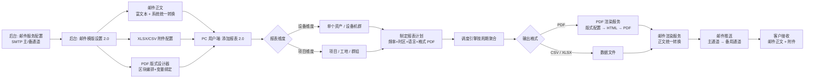
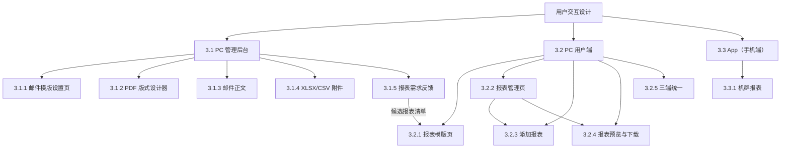
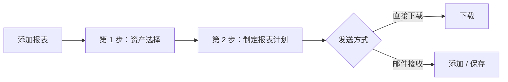
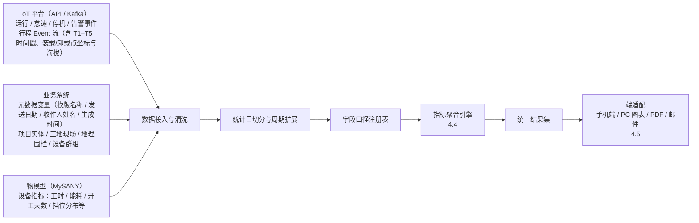
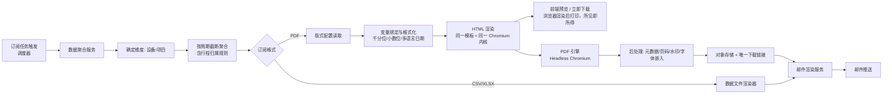
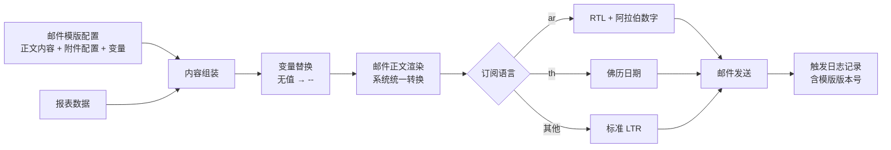
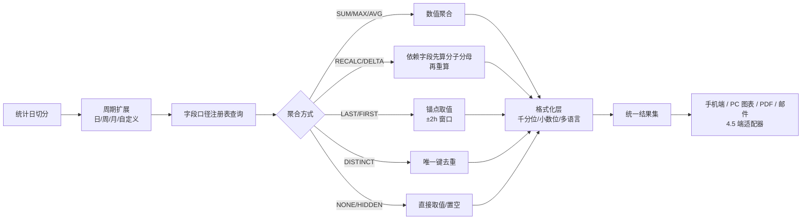
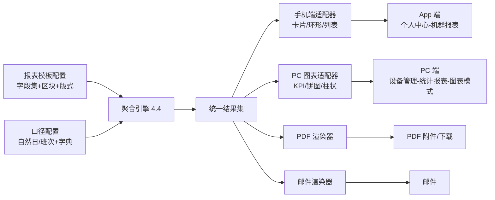

# 三一设备报表项目 PRD v2.0

## 原型入口

| 入口 | 页面 |
| --- | --- |
| **管理后台** | `V2/mysany后台V2/邮件模版设置.html`、`V2/mysany后台V2/报表需求反馈.html`（侧边栏「系统设置」下 4 项：邮件服务配置 / 邮件模版设置 / 触发日志 / 报表需求反馈） |
| **PC 用户端** | `V2/MysnayPC端V2/报表模版.html`、`V2/MysnayPC端V2/管理报表.html`（两页共用侧边栏与顶部「报表模版 / 管理报表」双 Tab） |
| **App 端** | `V2/app/机群报表.html`（统一模板演示：`V2/app/机群报表-统一模板演示.html`） |
| **价格 UI 设计稿** | `V2/价格UI设计稿.html` |

---

# 第 1 部分：业务概要

## 1.1 项目概述

### 1.1.1 项目背景

v1.0 已于 8 月完成「管理报表订阅 → 邮件推送 → 后台模版配置」全链路闭环，客户可用 CSV/XLSX 附件形式获取设备数据。但在真实交付中，也逐步反映出四类可改进的方向：

1. **交付物形态不足**：客户（尤其印度、印尼、中东等区域客户）更倾向直接转呈管理层的**成品报表**，而非需要二次加工的明细表格；CSV/XLSX 在承载「指标卡 + 图表 + 结论」这类表达上相对有限。
2. **缺少项目维度**：现有报表以「设备」为主体，而客户现场的存在**项目 / 工地**项目报表需求；部分客户希望按项目查看产出（如按行程统计的装载量、循环时间、台班效率），见 `用户需求/日周月报表字段聚合表.md` 1.2「客户需求 · 按行程的生产报告」。
3. **PDF 版式管控待补充**：1.0 未具备可控的 PDF 版式能力，附件仅能由管理员上传 `.docx` 模板，版式质量较大程度取决于人工排版水平，品牌一致性与多语言一致性较难稳定保证；该能力需在 v2.0 补充；**v2.0 不再保留 Word 模板方式**（复杂报表的分页、跨页表头、图表 Word 无法承载），统一走可视化版式设计器。
4. **邮件正文呈现待优化**：1.0 邮件正文为纯文本，难以美观地呈现品牌形象；在部分客户端可能出现「正文内容 \*」这类原始占位/星号文本、长表格错位等情况，观感与企业级形象存在差距。

### 1.1.2 项目目标

| 能力维度 | v1.0 | v2.0（目标） |
| --- | --- | --- |
| **报表维度与清单** | 仅设备维度（单个资产 / 设备机群，共 9 张） | **设备 + 项目双维度**：设备维度 **13 张**（按客户平台报表库取可实现清单，机型通用）+ 项目维度 **5 张** = **18 张可添加报表** |
| **PDF 输出** | **未实现**：格式下拉里只有「PDF」选项，无实际产出、无版式定义 | **本期建成 PDF 交付链路**：18 张报表全量支持 PDF，含 3 套版式（标准 / 精简 / 机群对比）与组件库 |
| **PDF 附件配置** | 上传 `.docx` 模板 + 键值映射（黑盒，质量取决于人工排版） | **可视化版式设计器**（区块编排 + 变量绑定 + 实时预览），**不保留 Word 模板方式** |
| **邮件正文** | 纯文本「通知 + 下载链接」，难以美观呈现品牌形象、在部分客户端出现「正文内容 \*」占位文本 | **保留富文本编辑，做展示样式优化**；推送时由系统统一转换，5 类客户端必过 |
| **PDF 预览** | 无 | 列表 / 详情弹窗内嵌 PDF 预览；设计器实时预览 |
| **周期计算口径** | 日 / 周 / 月**一律累加** | **按字段登记聚合方式**（求和 / 重算 / 期末快照 / 差值 / 最大值 / 去重计数 / 不呈现），切换周期即按字典联动 |
| **统计边界** | 固定自然日 00:00–24:00 | **可选自然日或自定义班次**（如 07:00–19:00 一个班次），订阅级配置 |
| **字段口径来源** | 分散在取数 SQL 与前端代码，各端口径可能不一致 | **以源文档为唯一来源 + 注册表集中登记**，逐条可追溯出处 |
| **端侧呈现** | 手机端机群报表（仅挖掘机）、PC 统计报表、邮件模版各自硬编码 | **一源多端**：同一份报表模板 + 口径配置，渲染到手机端 / PC 图表 / PDF / 邮件；字段与数值一致 |
| **报表列表** | 16 列 | 16 列 + **维度** 列；格式列显示 PDF 版式 |

---

# 第 2 部分：产品定义

## 2.1 系统使用流程

### 2.1.1 全流程总览（v2.0）

## 2.2 报表体系设计 2.0

### 2.2.1 双维度对比（设备 / 项目）

| 对比项 | 设备维度 | 项目维度（v2.0 新增） |
| --- | --- | --- |
| 统计主体 | 单个资产 / 设备机群 | 项目（工地现场 / 地理围栏 / 设备群组） |
| 数据粒度 | 设备 × 统计周期 | 项目 ×（设备 × 行程）× 统计周期 |
| 权限来源 | 设备权限（全部设备 / 组织+项目 / 个人设备） | **组织 + 项目权限**（复用 v1.2 三层权限模型中的第 2 层） |
| 典型问题 | 「这台设备这个月干了多少活」 | 「这个项目这个月产出了多少、效率如何、哪台设备拖后腿」 |
| 输出规模 | 单台（单机）/ 多台汇总（机群） | 项目汇总 + 设备清单 + 行程级明细（三级） |
| PDF 优先级 | P0 | P0（按行程生产报告）/ P1（其余） |

### 2.2.2 设备维度 · 13 张可添加报表

设备维度的报表清单**以客户平台现有报表库为基准**，本期取其中**数据已具备、容易实现**的部分，共 **13 张**（单机 6 张 + 机群 6 张 + 月度综合 1 张）。这些报表**不绑定机型**——凡有 T-Box 稳定上报的机型均可使用（挖掘机 / 宽体车 / 轮式装载机优先验证）。

| 序号 | 可添加报表 | 报表描述 |
| :-: | --- | --- |
| 1 | 设备利用率报表 | 单台设备怠速 / 工作 / 运行三段用时与利用率，并与预期工时对比 |
| 2 | 设备运行快照报表 | 运行小时 + 最后已知位置 + 仪表读数的快照 |
| 3 | 设备燃油效率报表 | 怠速 / 工作 / 运行三段油耗与燃烧率，判断用油是否经济 |
| 4 | 设备怠速分析报表 | 怠速事件数、总时长、平均时长（按阈值） |
| 5 | 设备事件统计报表 | 事件类型与次数汇总 |
| 6 | 设备事件历史报表 | 事件明细清单 |
| 7 | 机群作业状态报表 | 多台设备的 Running / Working / Idling 分段汇总 |
| 8 | 机群状态清单报表 | 机型 / 编号 / 最后位置 / 仪表读数一览 |
| 9 | 机群利用率报表 | 多台设备利用率对比（含预期工时对比） |
| 10 | 机群怠速与利用率报表 | 怠速时长、油耗、怠速占比 / 运行时长 |
| 11 | 机群燃油效率报表 | 多台设备三段油耗与燃油效率对比 |
| 12 | 位置历史报表 | 设备位置轨迹历史 |
| 13 | 单机月度 360° 报表 | 单机月度综合视图；**本期先做「利用率 + 作业」两块**，健康 / 维护 / 成本 / 可持续待数据 |

### 2.2.3 项目维度 · 5 张可添加报表（v2.0 新增）

| 序号 | 可添加报表 | 一句话功能 | 支持周期 | 输出格式 |
| :-: | --- | --- | :-: | --- |
| 1 | **项目生产报表（按行程）** | 按一次装载任务（Trip）算项目产出与循环效率 | 日 / 周 / 月 | CSV / XLSX / **PDF** |
| 2 | 项目效率报表 | 哪个设备、哪个环节拖慢项目，做设备间对比 | 日 / 周 / 月 | CSV / XLSX / **PDF** |
| 3 | 项目能耗报表 | 项目整体能耗与单位运输能耗 | 日 / 周 / 月 | CSV / XLSX / **PDF** |
| 4 | 项目安全报表 | 超速、急刹、告警按项目汇总 | 日 / 周 / 月 | CSV / XLSX / **PDF** |
| 5 | 项目设备清单报表 | 项目在册设备一览与状态 | 日 / 周 / 月 | CSV / XLSX / **PDF** |

### 2.2.4 统计口径：自然日 vs 班次（v2.0 新增）

**（1）业务背景**

v1.2 将「日」固定为自然日 00:00–24:00。但客户现场普遍按**班次**组织生产（典型：早 7:00 – 晚 7:00 一个 12 小时班次；部分客户两班倒 07:00–19:00 + 19:00–07:00）。按自然天切分会导致：

| 现象 | 后果 |
| --- | --- |
| 跨班次作业被切成两天 | 日报工时明显小于交接班台账，客户质疑数据准确性 |
| 接班后连续作业算作两个「开工天」 | 开工天数虚高，利用率、开工率失真 |
| 周/月边界与排班周期错位 | 周报对不上生产周报，无法与产量台账对齐 |
| 印尼客户反馈 | 需要 07:00–19:00 班次形式的数据，便于定位是哪个班次出了问题 |

**（2）定义**

| 术语 | 定义 |
| --- | --- |
| **统计口径** | 决定「一天」如何切分。两项：`自然日`（默认）/ `班次` |
| **班次时段** | 在「添加报表 → 统计口径 = 班次」内**直接配置**的多段时间（v2.0 不设独立模板库）：默认 `07:00–19:00` + `19:00–07:00`，可增删时段；单段 1–24 小时、时段不重叠、合计满 24 小时 |
| **统计日** | 一个统计单位。自然日 = 00:00–24:00；班次日 = 班次开始时刻 → 结束时刻（可跨自然日） |
| **主日期** | 统计日在界面/报表中显示的日期，取班次**开始时刻所在自然日**（如「2026-09-13（07:00–次日 07:00）」） |

**（3）周期对齐规则**

| 周期 | 自然日口径 | 班次口径 |
| --- | --- | --- |
| 日 | 00:00 – 24:00 | 所选班次的一个完整周期（如 07:00 – 次日 07:00） |
| 周 | 周一 00:00 – 周日 24:00 | 由 7 个连续统计日组成；起始星期可取所选（默认周一），起点时刻 = 班次开始时刻（如周一 07:00 – 次周一 07:00） |
| 月 | 自然月 1 日 00:00 – 月末 24:00 | 自然月中**首个统计日的起点**至**次月首个统计日的起点**（如 9/1 07:00 – 10/1 07:00）；报表标题标注起止时刻 |
| 直接下载 | 自定义日期范围（≤ 31 天，按月粒度时限定 3 个月） | 自定义范围按班次边界吸附：范围起止自动对齐到班次开始时刻，并在界面提示吸附结果 |

### 2.2.5 指标聚合规则（v2.0 新增）

**（1）前端联动规则**

| 序号 | 规则 | 说明 |
| :-: | --- | --- |
| 1 | **周期切换 = 字段集切换** | 在「添加报表 / 下载 / 预览」选择日 / 周 / 月 / 自定义范围时，切换的不只是算法，还包括字段清单本身——系统按「机型 × 周期」重新加载该周期的字段与显隐状态。前端不提供手动改算法的入口，避免客户自造口径。 |
| 2 | **不统计即不渲染** | 上一周期有、当前周期不统计的字段不再显示，并在报表配置与预览处提示「该字段在周报不统计（依据字段聚合表）」；标记「不呈现」的字段不展示，但在数据中保留。 |
| 3 | **必需字段锁定** | 标记为必需的字段不可在模板中取消勾选。 |
| 4 | **口径可解释** | 字段悬浮或详情中展示口径说明，例如「平均小时油耗 = 周期能耗 ÷ 周期工时」，便于客户理解。 |
| 5 | **渲染层不计算** | 报表渲染层只做取值与格式化，不做二次计算，统一由聚合引擎产出。 |
| 6 | **依赖可追溯** | 依赖型字段必须能追溯到分子、分母两个基础字段，缺失时显示「--」并标注原因。 |
| 7 | **快照取值锚点** | 期末、期初取值必须指定取值锚点（默认允许 2 小时延迟窗口），超出窗口视为无值。 |
| 8 | **模板按周期分别保存** | 报表模板按「机型 × 周期」分别保存，禁止用一个模板开关同时控制三个周期。 |

**（2）跨周期通用规则**

| 规则 | 适用字段 | 做法 |
| --- | --- | --- |
| **先算依赖、后算派生** | 派生字段 | 先对组成项求和，再参与后续计算；重算类字段的分子、分母必须是基础字段 |
| **比率类只重算、不平均** | 平均、每小时、占比、利用率 | 周 / 月一律按「周期分子 ÷ 周期分母」重算 |
| **期末、期初类取端点** | 液位、电量、健康度、累计读数 | 按期末 / 期初取值，并遵守 2 小时锚点窗口 |
| **计数类去重** | 预警次数、充电次数、开工台数 | 按唯一键去重后计数 |
| **周期标识类不参与计算** | 日期、编号、机型 | 直接取值，或按周期置空 |
| **未登记口径不渲染** | 未登记字段 | 以注册表为准，禁止在取数逻辑或前端另算一套口径 |

---

# 第 3 部分：用户交互设计

## 3.0 用户交互总览

**功能框架图**

## 3.1 PC 管理后台

### 3.1.1 邮件模版设置页

**背景**

在 v1.2 结构上做如下调整（其余沿用）：编辑弹窗由 4 个 Tab 收敛为**三步向导**（邮件正文 / XLSX·CSV 附件 / PDF 附件，**仅第 2 步可跳过**）；「适用范围」不再由管理员勾选，改由附件步骤配置过的口径**自动汇总**；「预览与测试」不再作为独立步骤，面板并入 PDF 附件步骤。

**（1）功能流程说明**

邮件模版列表 → 新建 / 编辑模版（三步向导：① 邮件正文（必填）→ ② XLSX·CSV 附件 → ③ PDF 附件）→ 完成并保存 → 列表刷新。

**（2）相关页面**

> 【原型图片】邮件模版列表页
> 【原型图片】编辑模版弹窗

**（3）交互**

1. 模版列表（共 10 列）：
   ● 列顺序：图标 / 模版名称 / 适用范围 / 报告维度 / PDF 版式 / 模版描述 / 语言 / 启用 / 最近更新 / 操作。
   ● 「适用范围」列展示 `单机` / `机群` 标签（两种口径可同时出现）；「报告维度」列展示 `设备` / `项目`；「PDF 版式」列展示 `标准版（A4 横向）` / `精简版（A4 纵向）` / `机群对比版`；「启用」列展示 `已启用` / `已停用`。
   ● 操作列：编辑 / 删除；列表仅剩 1 条模版时「删除」置灰不可点（提示「至少保留一个模版」）。
   ● 筛选栏：模版名称（回车即触发搜索）+ 语言类型（15 种）+ 搜索 / 重置；列表标题右侧显示「共 N 个模版」，筛选后追加「（筛选后 M 个）」；空态文案「无匹配模版」。
2. 编辑模版弹窗 - 基本信息：
   ● 模版名称*、模版描述*、报告维度（`设备` / `项目`）。
   ● **不再提供「模版图标」「适用范围」「PDF 版式」三个字段**（原图标上传与移除、适用范围只读标签展示、PDF 版式下拉均已删除）；口径仍由第 2、3 步的切换产生。
   ● 顶部「编辑语言」下拉（15 种）：新建时可切换；编辑已有模版时置灰不可改；切换语言自动保存当前编辑内容，未配置的语言从简体中文复制。
3. 编辑模版弹窗 - 三步向导（**不再是 4 个步骤 Tab**）：
   ● 步骤条：`1 邮件正文`（必填）→ `2 XLSX / CSV 附件` → `3 PDF 附件`；每步状态显示 `必填` / `未配置` / `已配置` / `已跳过`（跳过的步骤置灰）；步骤条可点击跳转。
   ● 步骤 1 邮件正文：可用变量区（点击插入 `{{模版名称}}` `{{发送日期}}` `{{收件人姓名}}` `{{生成时间}}` `{{一键订阅}}` `{{查看报告}}`）+ 富文本编辑器（右上角可切 `富文本` / `HTML 源码`，见 3.1.3）。
   ● 步骤 2 XLSX/CSV 附件：文件名模板 + 数据列配置（见 3.1.4）；**仅本步可跳过**（「跳过此步（不生成 XLSX/CSV 附件）」），跳过后可「恢复此步」。
   ● 步骤 3 PDF 附件：文件名模板 + PDF 版式设计器（见 3.1.2）。
   ● 弹窗底部：启用此模版开关 + 重置 / 跳过此步（仅第 2 步且未跳过时出现）/ 上一步 / 下一步 / 完成并保存。
   ● 新建模版直接写入示例数据（示例名称、描述、图标、正文），保存后列表刷新并更新「最近更新」。
4. 预览与测试（**不再是独立步骤**）：
   ● 面板保留在 PDF 附件步骤内（原「预览 PDF」入口按钮已移除）。
   ● 面板内容：视图切换（桌面 / 移动 / 暗色 / 最差兼容）、预览语言、使用模拟数据、测试发送、邮件正文预览、PDF 报表预览、邮件客户端兼容性自检表（Outlook 桌面 / Outlook 网页 / Gmail / Apple Mail / QQ·163）。

**（4）规则**

1. 必填与校验：
   ● 模版名称、描述、正文必填；未通过则拦截并提示具体原因。
2. 语言与范围：
   ● 编辑已有模版时语言不可改；**适用范围由附件步骤的口径配置自动派生**（第 2、3 步都跳过时默认两种口径都支持），管理员不能手工增删（v1.2 的「模版类型单选」「适用范围勾选」均已取消）。
3. 数据列配置归属：
   ● 单机配置与机群配置各存一套；未进入某个步骤时不得覆盖该步骤已保存的配置，保证两套配置互不冲掉。
4. 权限控制：
   ● 页面按管理员权限开放，非管理员不可进入模版设置。（通用默认值）
5. 分页组件：
   ● 模版列表分页沿用现有页面分页组件规则。（通用默认值）

### 3.1.2 PDF 版式设计器

**背景**

目标：管理员无需开发介入，通过可视化配置即可产出与 `V2/报表模版/设备性能报表-SANY.html` 一致的 PDF 报表。设计器位于「邮件模版设置 → 第 3 步 PDF 附件」内，**单机 / 机群两套版式各存一份**。

**（1）功能流程说明**

选择管理范围（单机设备 / 机群（聚合））→ 选择统计时间维度（日报 / 周报 / 月报）→ 画布插入组件 → 右侧配置组件参数与绑定字段 → 校验通过 → 查看 json → 完成并保存。

**（2）相关页面**

> 【原型图片】PDF 版式设计器（画布 + 组件参数配置）

**（3）交互**

1. 配置方式（**只有一种：版式设计器**）：
   ● 组件插入画布 + 字段绑定，配置即所见；v2.0 起**不再提供 Word 模板方式**：报表需要跨页表头、分页控制、环形图 / 进度条等图表能力，Word 模板（`.docx` + 变量替换）承载不了，复杂报表尤其明显。
   ● 历史 `.docx` 模版的迁移方式：由实施在版式设计器内按原版式重建（不提供自动转换）。
2. 设计器顶部：
   ● 管理范围透视：`单机设备` / `机群（聚合）` 分段切换；**切换即整套替换模块与版式**，两套配置分别保存、互不影响。
   ● 统计时间维度：日报 / 周报 / 月报（可多选）。
   ● 查看 json：查看当前口径的发布内容（随模版保存时一并落库）。
3. 画布（A4 横向）：
   ● 「＋ 插入新数据组件」新增组件；画布上的组件可选中、调整顺序，选中后在右侧参数面板配置。
   ● 画布固定呈现 SANY 页眉与防伪水印。
4. 组件参数配置（右栏）：
   ● 可视化类型（6 种）：折线图 / 柱状图 / 饼状图 / 环形图 / 数据明细表 / 富文本段落。
   ● 标题 Key：按多语言键值渲染组件标题。
   ● 维度映射：机群图表可设 X 轴（按时间序列 / 按不同设备）与图例分组（对比不同指标 / 对比不同设备）；机群数据表可设表头列（各项业务指标 / 各台设备数据 / 时间序列（日期））与行（按设备罗列 / 按时间罗列）。
   ● 绑定字段：逐项添加 / 移除，来源为「＋ 手动输入」或「＋ 从字段库选择」（字段库浮层按「机群（共性字段）+ 设备类型 → 物模型 → 字段」组织，可多选）；未绑定字段时提示「尚未绑定字段，画布无法出图」。
   ● 富文本段落：填写段落内容。
   ● 物理排版：纸张宽度占比（`100%（满宽整行）` / `50%（半宽并排）`）、渲染完毕后强制换页、删除当前组件。
5. 校验：
   ● 设计器内实时校验并回显结论：「校验未通过：…」或「校验通过（机群 / 单机口径）：N 个组件，半数宽度 N 个，时间维度 …」。

**（4）规则**

1. 绑定校验：
   ● 每个组件至少绑定 1 个字段；组件标题 Key 必填；环形图各项占比合计需在 99.8%–100.2%；数据表至少 1 列且表头 Key 必填；变量取不到值时显示 `--`。
2. 版本与生效：
   ● 保存为**草稿**或**发布**；未发布不影响线上推送。
   ● 保留最近 **5 个**历史版本，支持「查看/回滚」。
   ● 发布后立即对新建订阅生效；已存在的订阅在下次推送时使用新配置（详情弹窗标注「版式已更新」）。
3. 权限控制：
   ● 仅管理员可进入版式设计器。（通用默认值）

**（5）功能边界值简要说明**

- 组件类型 6 种；单机 / 机群各一套版式；纸张宽度占比 100% / 50% 两档；是否强制换页按组件单独设置。
- 数据表至少 1 列；环形图占比合计 99.8%–100.2%；未绑定字段的组件不可出图。
- **不提供 Word 模板**：复杂报表（跨页表头、分页、图表）Word 无法承载；版式为唯一配置载体，避免「预览一种、推送另一种」。

### 3.1.3 邮件正文

**背景**

一句话目标：**保留富文本编辑方式不变**，推送时由系统统一把正文转换为邮件客户端可正常解析的格式，彻底消除 `正文内容 *` 这类原始占位文本。

| 现状问题 | 表现 | v2.0 做法 |
| --- | --- | --- |
| 占位文本外泄 | 邮件里出现 `正文内容 *`、裸 `*` 星号 | 必填标记只留在字段标签上，不进入编辑区；推送前统一清理占位文本与未替换变量 |
| 样式丢失 | 按钮变形、表格错位、字号不一致 | 正文由系统统一转换为客户端可正常解析的格式，管理员无需关心实现方式 |
| 呈现单薄 | 仅「通知 + 一个按钮」 | 富文本支持标题、加粗 / 斜体 / 下划线 / 删除线、文字与背景色、对齐、列表、引用、代码块、链接、图片 |
| 多语言不齐 | 阿拉伯语 RTL 与泰语佛历展示异常 | 按订阅语言自动切换文字方向与日期体系 |

**（1）功能流程说明**

编辑富文本 → 插入变量 → 预览与测试 → 推送时由系统统一转换。

**（2）相关页面**

> 【原型图片】邮件正文编辑器
> 【原型图片】预览与测试面板

**（3）交互**

1. 正文编辑（两种模式，右上角切换）：
   ● **富文本模式**（默认，Quill 类编辑器）：管理员所见即邮件主体内容。
   ● **HTML 源码模式**：直接编辑正文 HTML 源码，内容原样保存、往返不丢；从源码切回富文本时由编辑器做结构简化（会提示）。
   ● 支持格式：段落 / 标题、加粗、斜体、下划线、删除线、文字颜色 / 背景色、对齐、有序 / 无序列表、引用、代码块、链接、图片、清除格式。
   ● 变量插入：点击变量标签插入（基础信息 6 条：模版名称 / 发送日期 / 收件人姓名 / 生成时间 / 一键订阅 / 查看报告），也支持手输 `{{变量名}}`；插入后以蓝色标签高亮识别。设备指标变量词典覆盖 14 类设备、34 个物模型，共约 100+ 条字段指标；语言 15 种。
2. 系统固定部分（管理员不可改）：
   ● 页头品牌条：`SANY · MySANY 设备管理平台`（三一红底白字，随语言切换文案）。
   ● 页脚：「此邮件为系统自动发送，请勿直接回复。」+ 服务团队署名 + 「调整订阅」文字入口。
   ● 主按钮：「查看并下载完整报告」→ `{{查看报告}}`（URL 由开发内置）。
3. 预览与测试（**不再是独立步骤**，面板位于 PDF 附件步骤内，见 3.1.1 第 4 条）：
   ● 邮件正文预览 + PDF 报表预览 + 5 客户端兼容性自检；支持视图切换（桌面 / 移动 / 暗色 / 最差兼容）、预览语言切换、使用模拟数据与测试发送。

**（4）规则**

1. 占位文本处理：
   ● 必填标记只留在字段标签上，不进入编辑区；推送前统一清理占位文本与未替换变量。
2. 样式转换：
   ● 正文由系统统一转换为客户端可正常解析的格式，管理员无需关心实现方式。
3. 多语言：
   ● 按订阅语言自动切换文字方向与日期体系（ar 自动 RTL、th 佛历）。
4. 明确不做：
   ● **不提供「邮件版式模板」「模块化拖拽」「指标卡配置」等能力**；邮件正文 = 富文本内容 + 系统固定的页头页脚。
5. 权限控制：
   ● 仅管理员可编辑邮件正文；系统固定部分不可改。（通用默认值）

**（5）功能边界值简要说明**

必过客户端（验收基线）：

| 客户端 | 展示要求 | 说明 |
| --- | --- | --- |
| **Outlook（桌面）** | 与预览一致 | 桌面版对圆角与内嵌图片支持有限，需保证按钮与表格不塌陷 |
| **Outlook（网页）** | 完整还原 | — |
| **Gmail** | 完整还原 | 品牌 Logo 不显示时自动以文字品牌替代 |
| **Apple Mail** | 完整还原 | — |
| **QQ 邮箱 / 163 邮箱** | 可正常阅读 | 个别样式可能降级，但文字、表格、按钮必须可读可点 |

上线前对这 5 类客户端逐项截图验收，五项全部通过才算达标。

### 3.1.4 XLSX/CSV 附件

**背景**

结构与交互沿用 v1.2，v2.0 仅把「单机 / 机群」两套列配置的切换方式收敛为弹窗内的分段切换。

**（1）功能流程说明**

配置附件（文件名模板 + 三级联动 / 数据列表）→ 推送时按订阅格式出附件。

**（2）相关页面**

> 【原型图片】邮件模版 · XLSX/CSV 附件步骤

**（3）交互**

1. 附件配置：
   ● 文件名模板（支持变量）必填。
   ● 口径切换：`单机设备` / `机群（聚合）` 分段切换，两种口径的列配置各存一套、互不影响（在哪个口径配置过，就为该口径产出附件）。
   ● 单机配置：设备类型 → 物模型 → 字段三级联动，字段可多选；底部显示已选变量数，并提供「取消全选 / 全选当前模型」；已配置的物模型以标签列出，已选变量集中回显（点击 × 移除）。
   ● 机群配置：数据列配置表（列名 / 模板变量 / 操作），可「＋ 添加列」；模板变量单元格点击后弹出三级联动浮层选择映射字段（与 PDF 附件复用同一弹层）。
   ● 基础字段「统计周期 / 设备机型 / 设备编号」在单机口径下只读、不可删除。
2. 预览与测试：
   ● 在 PDF 附件步骤的预览面板内一并验证邮件正文、附件与 PDF（见 3.1.1 第 4 条）。

**（4）规则**

1. 变量系统：
   ● 附件与邮件正文的字段口径共享同一变量系统（`{{统计周期}}`、`{{设备编号}}` 等）。
2. 推送规则：
   ● 推送时按订阅格式择一出附件。
3. 权限控制：
   ● 仅管理员可配置附件。（通用默认值）

**（5）功能边界值简要说明**

- **默认只出订阅所选格式的附件**。

### 3.1.5 报表需求反馈

**背景**

本页承担两件事：① 承接 PC 用户端「我需要更多报表」提交的诉求（用户端两页提交后写入本地缓存，后台集中展示与处理，形成「用户提诉求 → 后台评估排期 → 状态回写」的闭环）；② 配置用户端「我需要更多报表」弹窗里的**候选报表清单**（用户端读同一份配置渲染）。

**（1）功能流程说明**

链路一（需求处理）：用户端「我需要更多报表」提交 → 后台「报表需求反馈」列表 → 筛选 / 修改状态（二次确认）→ 状态仅前进一步，`已上线` 为终态。
链路二（候选清单配置）：「＋ 添加候选报表」→ 逐项维护名称 / 标签 / 描述 / 预览图（按语言）→ 保存配置 → 用户端「我需要更多报表」弹窗同步展示。

**（2）相关页面**

> 【原型图片】报表需求反馈列表页
> 【原型图片】候选报表配置弹窗

**（3）交互**

1. 统计卡片（4 张）：
   ● 累计提交（全部需求数）/ 待评估 / 已排期 / 已上线；**不设「暂不实现」卡片**；按全部数据统计，不受筛选影响。
2. 筛选栏（5 个条件 + 搜索 / 重置筛选）：
   ● 状态（下拉：全部 / 待评估 / 已排期 / 已上线 / 暂不实现）、提交人（文本）、用户ID（文本）、**国家（可输入下拉，选项由数据内出现的国家动态生成）**、报表名称（文本）。
   ● 各条件只匹配各自字段，多条件取交集；**不提供导出**。
3. 列表（8 列；列表上方右侧为「＋ 添加候选报表」）：
   ● 列顺序：提交人 / 用户ID / 用户国家 / 申请的报表（纯文本，顿号分隔）/ 自定义诉求（超 34 字截断 + 悬浮查看全文）/ 状态 / 提交时间 / 操作。
   ● 状态标签：待评估（橙）/ 已排期（蓝）/ 已上线（绿）/ 暂不实现（灰）；空态文案「暂无提交的需求」。
4. 状态修改：
   ● 操作列为状态下拉，变更前弹二次确认（展示「提交人 + 需求 + 由旧状态变更为新状态」）；取消则回退到原状态。
   ● **`已上线` 为终态**：该行下拉置灰禁用并提示不可再变更，服务端同样拦截。
5. 数据来源与示例数据：
   ● 读取用户端写入的本地缓存（键名 `mysany_report_requests`）；来源字段区分「报表模版 / 管理报表」。
   ● 记录字段：需求编号、提交时间、提交人、用户ID、国家、来源、申请报表（数组）、自定义诉求、状态。
   ● 内置 4 条示例数据（四种状态各 1 条）；带版本号机制，示例数据更新后自动覆盖旧缓存。
6. 候选报表清单配置（「＋ 添加候选报表」弹窗）：
   ● 逐行维护候选项，每行字段：预览图（点击上传 / 移除）、报表名称*、标签类型（`已规划` / `可申请`）、一句话描述、删除行；底部「＋ 添加一项」+ 项数统计 + 取消 / 保存配置。
   ● 标题右侧提供**语言下拉（15 种）**：名称与描述按语言分别维护，切换语言只影响该语言的文本；未配置的语言回落到简体中文。
   ● 预览图上传后自动压缩存储（控制体积）；用户端按「有图用图、未配图用内置静态图」渲染，点击缩略图可放大查看。
   ● 校验：每项简体中文名称必填、名称不得重复、至少保留 1 项；不通过则拦截并提示，通过后提示「已保存 N 项候选报表」。

**（4）规则**

1. 状态流转：
   ● 只允许在四种状态间单向推进，`已上线` 之后不可再改；历史记录缺「用户ID / 国家」时按默认值补齐后回写。
2. 提交入口一致性：
   ● 用户端两页提交的诉求进入同一列表，仅「来源」不同（报表模版 / 管理报表）。
3. 权限控制：
   ● 仅管理员可查看与变更状态、配置候选清单。（通用默认值）
4. 分页与排序：
   ● 当前按提交时间倒序、仅展示条数统计；分页沿用现有页面分页组件规则。（通用默认值）
5. 候选清单与用户端联动：
   ● 清单保存后用户端下次打开弹窗即读到最新内容；用户端标签文案由标签类型（已规划 / 可申请）自动生成；未配置预览图的候选项用内置静态图兜底，保证点击可看大图。

**（5）功能边界值简要说明**

- 自定义诉求截断 34 字（悬浮看全文）；申请报表多选无上限；不做导出与批量改状态。
- 候选清单：至少 1 项、名称不得重复、名称与描述各支持 15 种语言、预览图单张自动压缩。

## 3.2 PC 用户端

### 3.2.1 报表模版页

**背景**

PC 用户端的报表库：用户先看有哪些报表，再「添加」进入报表管理页配置订阅。v2.0 起**不再区分单机 / 机群两套页面**——同一套字段按所选资产范围取数，单机 / 机群视图在预览弹窗内切换。

**（1）功能流程说明**

进入「报表模版」（侧边栏「机群报表」或顶部 Tab）→ 搜索 / 切换视图 → 卡片「预览」查看示例 → 「添加」或预览弹窗「使用该报表」→ 跳转「管理报表」页；若没有想要的报表，点右上角「我需要更多报表」勾选候选报表或填写自定义诉求提交。

**（2）相关页面**

> 【原型图片】报表模版页 · 网格视图
> 【原型图片】报表模版页 · 列表视图
> 【原型图片】报表预览弹窗

**（3）交互**

1. 页面框架：
   ● 与「管理报表」页共用侧边栏（设备管理 / 数据大屏 / 机群报表 / 项目管理 / 设备保养 / 维修管理）与顶部 Tab（报表模版 ↔ 管理报表）；右上角为「我需要更多报表」入口。
2. 报表清单（36 张，按分组展示）：
   ● 分组与数量：设备概览 4 / 能耗与成本 6 / 作业与效率 7 / 安全与事件 5 / 位置与维保 6 / 发电机 3 / 项目维度 5。
   ● 其中 **12 张数据源未接入**（共享资产视图、成本分析（单机 / 机群）、故障码、油液分析 3 张、发电机 3 张、工地停留、安全-用户操作）：卡片置灰、隐藏「添加」按钮，并标注「数据源未接入 · 本期不实现」。
   ● 已有状态标签的 6 张：`已上线` 3 张（设备能耗、设备工作模式、设备移动）（红）/ `已计划` 3 张（超时工作、设备异常通知、电池电量）（蓝）。
3. 工具栏与视图：
   ● 搜索框：按报表名称 / 英文名 / 描述 / 指标模糊匹配；无结果显示「未找到匹配的报表」。
   ● 视图切换：网格（默认）/ 列表；**无排序控件**。
   ● 跳转：本页与「管理报表」页构成顶部双 Tab，互为镜像。
4. 卡片与操作：
   ● 网格卡片展示：图标、名称、状态标签、副标题（分组 · 描述），按钮「预览」「添加」。
   ● 「添加」→ 二次确认后跳转「管理报表」页；不可用报表无「添加」按钮。
5. 预览弹窗：
   ● 有指标：提供「单机视图 / 机群视图」分段切换，标注「示例数据，仅示意展示效果」；表格为「统计周期 + 设备机型 + 设备编号 + 指标列」（机群视图不含机型列，示例 3 台设备）。
   ● 无指标：虚线框提示「该报表所需数据源尚未接入，本期不实现，暂无示例数据」，并隐藏「使用该报表」。
   ● 底部：关闭 / 使用该报表（→ 跳转「管理报表」页）。
6. 「我需要更多报表」弹窗：
   ● 入口：顶部 Tab 栏右侧的「我需要更多报表」按钮。
   ● 候选报表（可多选）：候选项来自后台「报表需求反馈」配置的清单（未配置时用内置默认清单），每项含复选框、预览图缩略图、报表名称 + 标签（`已规划` / `可申请`）与一句话描述。
   ● 预览图：点击缩略图放大查看大图（点任意位置或按 Esc 关闭）；**未上传预览图的候选项同样列出，用内置静态图兜底**，保证每一项都可点开看图。
   ● 自定义诉求说明：多行文本，可直接描述想要的报表（含字段、周期等）。
   ● 提交校验：至少勾选一张候选报表或填写自定义诉求，否则拦截提示；提交成功后提示已提交，并说明可在后台「报表需求反馈」查看处理进度。
   ● 候选项名称与描述随界面语言切换展示（未配置的语言回落简体中文）。
7. 新手引导：
   ● 进入页面后 4 步聚光灯引导（步骤 x/4）：侧边栏「机群报表」→ 卡片「预览」→ 卡片「添加」→ 顶部 Tab「管理报表」；支持跳过指引、上一步 / 下一步，末步按钮为「开始使用」。

**（4）规则**

1. 可用性判定：
   ● 以「是否配置了指标（数据源）」判定报表是否可用；不可用报表置灰但保留展示，便于用户与客服对齐已规划清单。
2. 跳转规则：
   ● 「添加」「使用该报表」均跳转管理报表页，由用户在弹窗内选择资产与计划。
3. 权限控制：
   ● 按用户权限返回可见报表与资产范围。（通用默认值）
4. 分页组件：
   ● 列表视图分页沿用现有页面分页组件规则。（通用默认值）

**（5）功能边界值简要说明**

- 报表库规模 36 张（设备维度 31 + 项目维度 5）；不做报表收藏、不做自定义排序。

### 3.2.2 报表管理页

**背景**

在 v1.2 管理报表页基础上做增量，其余（搜索、开关、状态、操作列、分页、帮助按钮）保持不变；**v2.0 起移除格式过滤**，筛选能力收敛为「归属切换 + 关键词搜索」。

**（1）功能流程说明**

管理报表列表 → 归属切换（我的 / 全部）+ 关键词搜索 → 查看详情弹窗 → 编辑（直入第 2 步）/ 删除（二次确认）；右上角「添加报表」新建订阅。

**（2）相关页面**

> 【原型图片】管理报表页 · 列表
> 【原型图片】管理报表页 · 详情弹窗

**（3）交互**

1. 工具栏：
   ● 左：`仅显示我的` / `全部显示` 切换 + 搜索框（对报表名称 / 类型 / 所有者 / 收件人 / 主题 / 资产模糊匹配）。
   ● 右：帮助按钮（悬浮「推送权限说明」：设备可见性、推送前即时校验、权限变更不自动剔除、编辑时强制同步、收件人限制）+ `添加报表` 按钮。
   ● **无格式过滤控件、无列排序**（v1.2 的格式下拉多选已移除）。
2. 列表（18 列）：
   ● 列顺序：报表名称 / 报表类型 / 维度 / 所有者 / 频率 / 数据范围 / 统计口径 / 格式 / 收件人 / 资产 / 主题 / 接收日期 / 接收时间（时区 + 时间）/ 生效区间 / 创建时间 / 开关 / 状态 / 操作。
   ● 「维度」列：`设备`（灰底标签）/ `项目`（红底标签），紧邻「报表类型」列之后。
   ● 「格式」列：`CSV` / `XLSX` / `PDF`。
   ● 空态：「未找到匹配的报表」（含插图）。
3. 行内操作与状态：
   ● 操作列：详情 / 编辑 / 删除；删除弹「确认删除？」二次确认，确认后移除并提示「报表已删除」。
   ● 开关：已过期 / 已失效行开关置灰不可切换。
   ● 状态标签四类：`正常` / `已过期`（超过截止日期、推送已停止）/ `已失效`（权限变更，如设备转移、用户移出组织）/ `部分失效`（机群部分设备离开），后三类悬浮显示原因。
4. 详情弹窗：
   ● 报表信息：报表维度、报表类型、所有者、频率、格式、PDF 版式、统计口径、聚合主体、电子邮件主题、开始 / 结束日期、时区、创建时间、资产 / 项目数量、开关、状态。
   ● 收件人区：收件人数量 + 收件人列表；Esc / 点击遮罩关闭。
5. 编辑：
   ● 「编辑」直接进入弹窗第 2 步（跳过资产选择），编辑态不可返回第 1 步；保存按钮文案「保存」，成功后提示「报表已更新」。
6. 新手引导：
   ● 进入页面后 3 步聚光灯引导（步骤 x/3）：侧边栏「机群报表」→ 「添加报表」按钮 → 顶部 Tab「报表模版」；支持跳过指引 / 上一步 / 下一步，末步按钮为「知道了」。

**（4）规则**

1. 列表页展示：
   ● 某列内容超过列宽 80% 时以「...」缩略显示；鼠标悬停显示气泡提示完整内容，内容过长时气泡固定高度防止溢出。（通用默认值）
2. 联动规则：
   ● 「维度」列与「报表类型」列联动：项目维度报表类型名以「项目」开头。
3. 权限控制：
   ● 页面按用户权限返回可见报表范围；无操作权限的报表不显示编辑 / 删除入口。（通用默认值）
4. 分页组件：
   ● 每页 10 条，沿用现有页面分页组件规则。（通用默认值）

**（5）功能边界值简要说明**

- **不做维度过滤**：维度信息通过「维度」列直接呈现，不额外增加筛选控件（避免工具栏冗余）。
- **PDF 预览入口**：v2.0 原型未在列表 / 详情内放置 PDF 预览控件，预览与下载的交互定义保留在 3.2.4 作为实现依据。

### 3.2.3 添加报表

**背景**

v2.0 原型的「添加报表」只走**设备维度**：弹窗内不再出现「所有设备 / 项目维度」维度 Tab，统一用「报表类型下拉 + 资产穿梭框」；项目维度的类型清单与选择区（4 个来源 Tab + 双栏穿梭 + 20 个上限）保留结构但入口不开放；班次设置由独立页面改为**弹窗内直接配置多时段**。

**（1）功能流程说明**

入口：管理报表页右上角「添加报表」→ 宽版模态弹窗，标题「添加报表」，右上角关闭。**2 步**：`① 资产选择` → `② 制定报表计划`；底部固定「取消 / 后退 / 下一个（或下载 / 添加 / 保存）」。

**（2）相关页面**

> 【原型图片】添加报表弹窗 · 第 1 步（资产选择）
> 【原型图片】添加报表弹窗 · 第 2 步（制定报表计划）

**（3）交互**

1. 第 1 步 - 报表类型：
   ● 报表类型 = 「定期报表类型」：上方「单机 / 机群」左右 Tab 分组 + 下方类型下拉（沿用 v1.2 的定期报表类型）。
   ● 类型清单（设备维度 13 项）：单机 7 项（设备利用率报表、设备运行快照报表、设备燃油效率报表、设备怠速分析报表、设备事件统计报表、设备事件历史报表、单机月度 360° 报表）+ 机群 6 项（机群作业状态报表、机群状态清单报表、机群利用率报表、机群怠速与利用率报表、机群燃油效率报表、位置历史报表）；项目维度 5 项（项目生产报表（按行程）、项目效率报表、项目能耗报表、项目安全报表、项目设备清单报表）随清单保留但入口不开放、暂不可选。
   ● 选中类型后展示类型说明副文案；类型与资产数量联动（单机类型限选 1 台）。
2. 第 1 步 - 资产选择：
   ● 穿梭框：左栏「查找资产」搜索 + 全部添加 + 筛选 + 资产分组（工程机械 / 运输车辆 / 动力设备）折叠与组内全选；右栏「已选资产」+ 上限提示 + 删除全部 (N) + 二次搜索；空态「未找到资产」/「暂无已选资产」。
   ● 单机类型提示「仅支持 1 个」，选中 1 台后其余设备不可再添加；机群提示「最多 100 个」。
   ● 未选择报表类型时，资产穿梭框不展开。
3. 维度切换：
   ● 弹窗内**不出现维度 Tab**（统一为「报表类型下拉 + 资产穿梭框」）；项目维度的选择面板与专属配置保留结构但隐藏。
4. 项目维度（暂不开放，结构保留）：
   ● 4 个来源 Tab：所有项目（默认）/ 工地现场 / 在地理围栏中 / 在群组中。
   ● 双栏面板：左栏搜索 + 排序（A→Z / Z→A / 最近使用）+ 多选项目列表（带设备数徽章）+ 空态「未找到匹配的项目」；右栏「已选项目」+「全部移除 (N)」+ 二次检索 + 按来源分组折叠 + 空态「暂未添加任何项目」。
   ● 底部计数：「已选 N 个项目 · 覆盖 M 台设备」实时刷新。
5. 第 2 步 - 基础信息：
   ● 报表名称：进入本步时若为空自动填入 `{报表类型名称} 报表`，限 100 字符，实时字数计数（必填）。
   ● 格式：CSV（默认）/ XLSX / PDF（下拉单选）。
   ● 频率：每日（默认）/ 每周 / 每月（v2.0 与发送方式解耦，两种发送方式下均显示；另有隐藏值「下载」用于直接下载）。
   ● 发送方式：直接下载 / 邮件接收（分段切换，默认「邮件接收」）。
6. 第 2 步 - 统计口径与班次：
   ● 统计口径：自然日（00:00–24:00）/ 班次（自定义），**仅「每日」频率显示**；周 / 月按自然周期统计。
   ● 班次时间：默认两段 `07:00–19:00` + `19:00–07:00`，可「＋ 添加时间段」配置多条不重叠时段，实时回显合计时长。
   ● 校验：单段 1–24 小时、时段不重叠、合计满 24 小时。
   ● 日期语义：主日期 = 班次开始时刻所在自然日（如 `2026-09-13（07:00–19:00）`，跨天标注次日）。
7. 第 2 步 - 时间范围与周期：
   ● 时间范围标签随发送方式变化：直接下载 = 「开始 / 结束日期（必填）」；邮件接收 = 「开始 / 结束日期（选填）」。
   ● **每月 + 直接下载**：日期控件切换为「开始月份 / 结束月份」月份选择器。
   ● 默认数据范围随频率：每日 = 前一天、每周 = 上周、每月 = 上个月；接收日期（周报 = 星期一…日、月报 = 1–28 号）；接收时间 = 时区（UTC-12 ~ UTC+12，含中文地区名，默认 UTC+8）+ 递送时间（00:00–23:30，30 分钟粒度）。
   ● 「包括周末」勾选框：仅每日频率显示。
8. 第 2 步 - 邮件交付配置（发送方式 = 邮件接收时）：
   ● 邮件主题：进入本步时若为空自动填入 `{报表类型名称} {频率} 报表`（切换频率时会同步刷新该自动生成的主题），限 200 字符，实时字数计数（必填）。
   ● 添加收件人：仅组织内已绑定邮箱用户（搜索下拉 + 已选卡片可移除），附「前往绑定 →」跳转个人中心；无匹配时提示「未找到匹配的用户」。
9. 底部按钮与流程：
   ● 第 1 步：「取消」+「下一个」。
   ● 第 2 步：邮件接收模式显示「后退」+「添加」（新建）/「保存」（编辑）；直接下载模式显示「下载」。
   ● 编辑既有报表时直接进入第 2 步，不可返回第 1 步。

**（4）规则**

1. 步骤校验：
   ● 第 1 步：未选类型提示「请先选择报表类型」；未选资产提示「请至少选择一个资产」；单机类型选多台提示「此报表类型仅支持选择一个资产」；机群超过 100 台提示「最多只能选择 100 个资产」。
   ● 第 2 步：报表名称、数据范围、接收日期、接收时间、收件人、起止日期逐项校验；结束日期早于开始日期、日期范围超过一年时拦截并提示。
   ● 关闭弹窗时若内容有改动，弹「未保存」二次确认（后退 / 离开）。
   ● 编辑模式下不能返回第 1 步（提示「编辑模式下不能返回资产选择」）。
2. 选项联动：
   ● 统计口径仅「每日」可选；「包括周末」仅每日显示。
   ● 时间范围控件随「发送方式 + 频率」联动（每月 + 直接下载 = 月份选择器）。
   ● 班次时段非法（重叠 / 合计不足 24 小时 / 单段超 24 小时）时禁止进入下一步。
3. 权限控制：
   ● 仅展示用户权限范围内的资产；无权限资产不渲染。（通用默认值）
4. 分页组件：
   ● 资产列表分页沿用现有页面分页组件规则。（通用默认值）

**（5）功能边界值简要说明**

| 边界 | 值 |
| --- | --- |
| 资产选择上限 | 单机类型 1 台；机群 ≤ 100 台 |
| 报表名称 | ≤ 100 字符 |
| 邮件主题 | ≤ 200 字符 |
| 班次时段 | 单段 1–24 小时；多段不重叠；合计满 24 小时 |
| 直接下载时间范围 | 起止日期必填；按月选择时为月份粒度（限定 3 个月） |
| 项目选择上限（暂不开放） | 20 个 |
| 跨项目合并 | **不做**：多选多个项目时按项目分别输出，不合并为一份汇总 |

### 3.2.4 报表预览与下载

**（1）功能流程说明**

列表「详情 → 预览 PDF」或下载 → 读取 / 生成 PDF → 内嵌预览或触发下载。

**（2）相关页面**

> 【原型图片】PDF 预览抽屉 / 全屏弹窗

**（3）交互**

1. 预览入口：
   ● （**v2.0 原型未实现**，以下为交互定义）列表操作列「详情」→ 详情弹窗内「预览 PDF」；或格式为 PDF 的行提供「预览」快捷链接。
2. 预览呈现：
   ● 抽屉或全屏弹窗内嵌 PDF 阅读器（`pdf.js` 或浏览器原生），支持翻页、缩放、下载、打印。
   ● 预览遵循订阅语言；管理员在后台预览时可切换语言。
3. 下载：
   ● 直接下载（频率 = 下载）：选资产 + 日期范围（≤ 31 天）+ 输出格式；v2.0 增加 PDF 版式选择。
   ● 重新下载：列表「详情 → 重新下载」，按原格式与版式重新生成。
   ● 项目维度下载：同样限 31 天；导出内容含项目汇总 + 设备明细 + 行程明细（按 3.2.3 汇总层级）。

**（4）规则**

1. 预览数据来源：
   ● 预览使用**最近一次生成**的 PDF；未生成过则展示「使用最近一个完整周期数据生成预览」（预览文件带 `PREVIEW` 水印且不落库）。
2. 生成中状态：
   ● 下载按钮转为「生成中…」，完成后浏览器自动触发下载；超 60s 提示「生成较慢，已转为邮件发送」。
3. 权限控制：
   ● 预览 / 下载按订阅主体的可见范围生成，禁止越权聚合。（通用默认值）

**（5）功能边界值简要说明**

- 下载日期范围 ≤ 31 天。

### 3.2.5 三端统一（手机端机群报表 / PC 统计报表）

**背景**

> 说明：本节描述目标态（PC 图表模式、手机端）。v2.0 原型交付「报表模版页 + 管理报表页 + 添加报表弹窗 + 报表需求反馈（含候选报表清单配置）」，手机端与 PC 图表模式仍以现有实现为准。

| 端 | 现状 | 问题 |
| --- | --- | --- |
| **手机端 · 个人中心 → 机群报表** | 页面为「挖掘机机群报表」：顶部机型切换（**当前仅挖掘机**）、日报 / 周报 / 月报 Tab、主日期选择器；底部口径说明（如「开工台数：统计当天在线时长 ≥ 30 分钟的设备数量」，v2.0 起改为「当日有运行工时数据的设备即计入」）；提示「机群报表部分数据最长 48 小时更新」；未绑定设备时显示引导「立即绑定设备，开启智能管理」 | ① 机型覆盖不全；② 字段、口径、文案全部硬编码在 App，改口径需发版；③ 与 PC / 邮件口径容易不一致 |
| **PC · 设备管理 → 设备列表 → 统计报表 → 图表模式** | 图表版统计报表，独立实现 | 图表与字段各自维护一套，改一次口径要改多处 |

目标：统一三要素，端只负责渲染适配，**不再各自硬编码**。

| 要素 | 说明 | 维护位置 |
| --- | --- | --- |
| 数据源 | 统一数据源（同一套聚合引擎，见 4.4） | 后端 |
| 模板 | 报表模板 = 字段集 + 区块结构 + 版式（PDF/图表/卡片映射） | 后台（3.1.2 版式设计器 + 报表模板） |
| 口径 | 统计口径（自然日/班次）+ 字段聚合方式字典 + 术语说明（如「开工台数」定义） | 2.2.5 字典、3.2.3 添加报表（统计口径与班次） |

**（1）功能流程说明**

同一套「数据源 + 模板 + 口径」→ 统一结果集 → 适配到手机端 / PC 图表 / PDF / 邮件四端。

**（2）相关页面**

> 【原型图片】手机端 · 个人中心 → 机群报表
> 【原型图片】PC · 设备管理 → 设备列表 → 统计报表（图表模式）

**（3）交互**

1. 手机端 - 机型切换：
   ● 机型切换从「仅挖掘机」扩展为按用户权限返回的全部机型；切换后按机型加载统一模板。
2. 手机端 - 周期 Tab：
   ● 日报 / 周报 / 月报 Tab 切换即切换聚合粒度。
   ● 日期选择器语义随口径变化：自然日显示 `2026/09/13`；班次口径显示 `2026/09/13（07:00–19:00）`，跨天班次标注「次日」。
3. 手机端 - 口径说明：
   ● 「开工台数」等定义由模板「说明文字」区块渲染，集中维护、多语言可配。
4. 手机端 - 数据延迟与空态：
   ● 数据延迟提示可配：`template.dataLatencyHours`（默认 48）由模板下发。
   ● 未绑定设备时保留现有插画与「立即绑定设备，开启智能管理」引导。
5. PC 统计报表（图表模式）：
   ● 图表类型与字段由同一模板 + 口径配置驱动，图表类型按 2.2.5 字典映射。
   ● 页面提供「口径说明」浮层：自然日 / 班次、起止时刻、逐字段聚合方式。
   ● 保留导出入口：图表 → PDF / XLSX（复用 PDF 渲染服务，所见即所得）。

端能力映射表（同一模板 → 四种渲染）：

| 模板区块 | 手机端（App） | PC 图表模式 | PDF 报表 | 邮件正文 |
| --- | --- | --- | --- | --- |
| 指标卡 | 顶部横滑卡片（2 列 × N） | KPI 卡片行 | 指标卡区（4 列） | 2×2 指标卡 |
| 环形 / 占比 | 环形进度 + 图例列表 | 饼图 / 环形图（可切换） | 环形图 + 图例 | 文字占比行 |
| 进度条 / 排行 | 横条列表（带名次） | 柱状图 / 条形图 | 进度条 | 迷你表（≤ 5 行） |
| 数据表 | 折叠列表（表头固定、横向滚动） | 可排序表格 | 数据表（跨页重复表头） | 迷你表 |
| 说明文字 | 底部「口径说明」区 | 悬浮 tooltip | 脚注 | 温馨提示 |
| 时间维度 | 日报 / 周报 / 月报 Tab + 主日期选择器 | 时间范围选择器 + X 轴 | 统计周期胶囊 | 生成时间 |

**（4）规则**

1. 端降级规则：
   ● **字段集不因端而减少**（手机端与 PC 字段完全一致），仅呈现形式降级——手机端表格默认折叠前 5 行 + 「查看全部」、长表格横向滚动；PC 不渲染打印专用页眉页脚。
2. 口径规则：
   ● 字段按 2.2.5 字典自动重算（如「平均小时油耗」重算、「燃油液位」取期末快照）。
   ● 开工台数判定 = 当日**有运行工时数据**的设备数。
   ● 与报表订阅共用同一份字段字典，消除两套口径。
3. 权限控制：
   ● 手机端按用户设备权限返回机型与数据；PC 图表按订阅主体可见范围取数。（通用默认值）
4. 性能：
   ● 手机端首屏仅请求首屏区块数据；下拉刷新复用同一接口；离线缓存最近一次成功结果。

**（5）功能边界值简要说明**

- 机型范围：按用户权限返回的全部机型；灰度顺序：挖掘机（当前已有）→ 宽体车 → 轮式装载机 → 全机型。
- 迁移方式：先落地「字段 → 聚合方式」注册表与统一数据源；PC 图表模式先做**影子比对**（新旧实现并行出数，数值一致后再切换），通过后按机型**直接切换**，不设旧版回退入口。
- 验收：同一份订阅配置在四端的**字段与数值一致**（组件形态可因端能力不同）；口径变更后四端同时生效、手机端无需发版（配置下发）；新增机型 / 字段只改配置，不改端上代码。

## 3.3 App（手机端）

### 3.3.1 机群报表

**背景**

- 现状：手机端「个人中心 → 机群报表」仅支持挖掘机，字段、口径、文案硬编码在 App，改口径需发版；与 PC / 邮件口径易不一致。
- 目标：由「统一模板 + 字段口径注册表」动态渲染，字段与周期可用性随机型 / 周期自动变化。

**(1) 功能流程说明**

进入「个人中心 → 机群报表」→ 选择机型 → 选择周期（日报 / 周报 / 月报）→ 选择日期 → 按统一模板渲染区块。

**(2) 相关页面**

> 【原型图片】手机端 · 个人中心 → 机群报表

**(3) 交互**

1. 顶部导航：
   ● 返回「‹」；标题「{机型}机群报表」（如「挖掘机机群报表」）。
   ● 机型切换：点击机型名（带 ▼）切换，按用户权限返回全部机型。
   ● 统计口径标识：顶部 chip 显示「统计口径：自然日 / 班次」。
2. 周期 Tab：
   ● 日报 / 周报 / 月报三段切换，切换即按该周期字段集重新渲染。
3. 日期选择器：
   ● 「‹ 主日期 ▼ ›」左右切换日期；自然日显示 `2026/09/13`；班次口径副行显示班次时刻，跨天班次标注「次日」。
4. 内容区块（按模板渲染，顺序固定）：
   ● 指标卡：顶部横滑卡片（2 列 × N），每卡含字段名、数值、单位，并以标签标注聚合方式（求和 / 重算 / 期末快照 / 最大值 / 必需）。
   ● 环形 / 占比：主值 + 图例项（≤ 4 项），占比合计 99.8%–100.2%。
   ● 排行 / 进度条：横条列表（带名次），按名次排序。
   ● 数据表：折叠列表（表头固定），默认展示前 5 行 + 「查看全部」，长表格横向滚动。
5. 口径说明与不统计提示：
   ● 底部「说明文字」区块渲染口径说明（多语言可配）。
   ● 「本周期不统计」区块列出当前周期不呈现的字段标题。
6. 空态：
   ● 未绑定设备时展示插画 + 「立即绑定设备，开启智能管理」引导。

**(4) 规则**

1. 字段渲染规则：
   ● 字段与周期可用性取「字段口径注册表」；当前周期不统计的字段不渲染，未登记口径的字段不渲染。
   ● 数值按聚合方式重算（比率类「周期分子 ÷ 周期分母」；快照类取期末）。
2. 降级规则：
   ● 字段集不因端而减少（与 PC 字段一致），仅呈现形式降级（折叠 / 横向滚动）。
3. 文案规则：
   ● 口径说明、术语定义由模板「说明文字」区块下发，不在 App 内硬编码。
4. 数据延迟：
   ● 页面提示「机群报表部分数据最长 {dataLatencyHours} 小时更新」（默认 48）。

**(5) 功能边界值简要说明**

- 机型范围：按用户权限返回的全部机型（灰度：挖掘机（已有）→ 宽体车 → 轮式装载机 → 全机型）。
- 数据延迟：默认 48 小时，可按报表配置。
- 不统计字段：当前周期不统计字段不渲染，仅在「本周期不统计」区列出标题。

---

# 第 4 部分：指标体系

## 4.1 指标变量相关说明

### 4.1.1 报表系统数据流转

> 三个数据源（oT 平台 / 业务系统 / 物模型）经**数据接入与清洗**后，依次经过**统计日切分 → 字段口径注册表 → 指标聚合引擎**，产出**统一结果集**，再适配到手机端 / PC 图表 / PDF / 邮件四端。其中**行程事件与 T1–T5 时间戳、装载/卸载点坐标与海拔**，以及**项目实体、工地现场、地理围栏、设备群组**为 v2.0 新增来源；物模型指标范围与「设备管理 → 设备详情 → 统计报表」一致。

### 4.1.2 公共变量全局定义表

**（1）物模型变量**

- 基于 MySANY 物模型提取，生成时实时拉取渲染，字段口径与 v1.2 一致。
- 基础字段「统计周期 / 设备机型 / 设备编号」在所有三级联动中**始终禁用且不可勾选**（沿用 v1.2 规则）。
- 单机报表字段名的 15 种语言翻译由开发内置，后台自动匹配。

## 4.2 项目维度报表

### 4.2.1 展示规范（印尼客户专项）

| 规则 | 说明 | 依据 |
| --- | --- | --- |
| 时长表达 | 禁止 `8.94h` 这类小数小时，统一「X 小时 Y 分钟」 | 源文档 §四 需求 13 |
| 班次口径 | 支持 12 小时制与 07:00–19:00 班次形式 | 源文档 §四 需求 12（见 2.2.4） |
| 导出补充 | 导出数据需补 stop time，并提供「一天跑多少公里 / 多长时间 / 平均速度」 | 源文档 §四 需求 13 |

## 4.3 系统架构与流转图

### 4.3.1 PDF 报表生成链路

**关键约束**

1. **模板单一来源**：PDF 模板（`{{变量}}` + `#loop_xxx` + 内联 CSS）只维护一份，前端预览与后端推送共用，禁止各自维护一套版式。
2. **两端同引擎**：前端「导出 PDF」走浏览器打印，后端走 Headless Chromium（渲染细则见《报表模版 / PDF 生成路线与 CSS 兼容性》），两端锁同一大版本，避免「预览与推送不一致」。
3. **前端生成的边界**：前端只负责预览与用户手动下载；**定时 / 批量 / 重发必须由后端产出**（浏览器无法常驻）。不使用截图式方案（html2canvas 等），保证 PDF 文字可搜索。
4. **富文本与 PDF 分离**：邮件正文走邮件客户端链路（table 布局 + 内联样式，5 客户端验收基线）；PDF 走 Chromium 链路（可用 flex / grid / 渐变），不把富文本正文当 PDF 模板内容。
5. **空值与不适用**：字段无值 → `--` 或隐藏行 / 块；机型不适用 → 不出该报表（见《机型适用性对照》与各报表内的「空值处理规则」）。

### 4.3.2 邮件渲染链路

## 4.4 指标聚合引擎

### 4.4.1 引擎职责

**关键约束**

1. **禁止链式重算**：`RECALC` 的分子分母必须是原子 `SUM` 字段，不允许 `RECALC` 再喂给另一个 `RECALC`（防止口径漂移）。
2. **精度**：中间计算不提前取整，最终按字段约定的小数位展示；占比类最后一步换算为百分比并保留 1 位。
3. **一致性校验**：同一份结果集内，子项之和应等于总量（如各功率段油耗之和 = 总油耗），偏差超过 0.5% 时告警。

## 4.5 统一数据标准

### 4.5.1 总体结构

### 4.5.2 统一数据标准的收益与约束

| 收益 | 说明 |
| --- | --- |
| 改一次、四端生效 | 口径调整（如新增班次口径）无需四套实现 |
| 口径一致 | 消除「App 说 284.4h、邮件说 282.1h」这类信任问题 |
| 扩展成本低 | 新增机型/字段只改注册表与模板 |

| 约束 | 说明 |
| --- | --- |
| 版本可追溯 | 结果集携带模版版本与口径版本，报表脚注与 App 详情页可查 |

---

# 第 5 部分：附录

## 5.1 统计口径与聚合方式速查

### 5.1.1 班次口径示例（以早班 07:00–19:00 为例）

| 周期 | 自然日口径区间 | 班次口径区间 |
| --- | --- | --- |
| 日 | `09-13 00:00 → 09-14 00:00` | `09-13 07:00 → 09-13 19:00`（主日期 09-13） |
| 跨天班（19:00–07:00） | `09-13 00:00 → 09-14 00:00` | `09-13 19:00 → 09-14 07:00`（主日期 09-13，标注「次日」） |
| 周 | `09-08 00:00 → 09-15 00:00` | `09-08 07:00 → 09-15 07:00` |
| 月 | `09-01 00:00 → 10-01 00:00` | `09-01 07:00 → 10-01 07:00` |

### 5.1.2 判断口诀（供客服 / 实施参考）

| 看到字段 | 是否累加 | 正确算法 |
| --- | --- | --- |
| 时长、里程、消耗量、次数 | ✅ 累加 | 子周期求和 |
| 「平均 / 每小时 / 占比 / 利用率」 | ❌ 不累加 | 周期总量相除（重算） |
| 「液位 / SOC / 健康度 / 读数」 | ❌ 不累加 | 取期末最后一个有效值 |
| 「最大速度 / 峰值」 | ❌ 不累加 | 取周期内最大值 |
| 「日期 / 编号 / 机型」 | — | 直接取值或按周期置空 |
| 「预警次数」 | ⚠️ 特殊 | 按告警 ID 去重后计数 |

